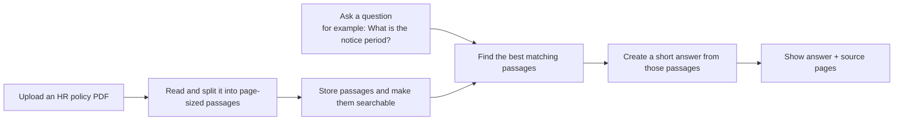

# HR Policy Finder

**Upload an HR-policy PDF, ask a question in plain English, and get an answer with the exact policy pages that support it.**

For example, a person can upload an employee handbook and ask, “How much annual leave do I get?” Instead of reading the whole document, the app finds the most relevant passages, produces a short answer, and lets the person check the original wording and page number.

## What this repository provides

- A simple web page for uploading a text-based HR-policy PDF and asking questions.
- A search pipeline that finds relevant policy passages using both meaning and keywords.
- A short Gemini-generated answer grounded in those passages.
- Supporting passages, document names, and page numbers so answers can be verified.
- Optional Supabase storage, so uploaded documents and search data survive a restart.

It is designed for **policy lookup**, not legal advice or a replacement for HR review.

## How it works



The app does not search the open internet. It answers from the PDF documents that have been uploaded to it.

## What happens after a question is asked

1. The app looks for passages with similar meaning to the question.
2. It also looks for exact words and phrases, such as “notice period” or “gratuity.”
3. It combines both results, ranks the strongest passages, and selects the best five.
4. Gemini receives only those passages and writes a short answer.
5. The page shows the answer alongside the source document and page number for review.

## Run locally

You need Python 3.9–3.12, a Gemini API key, and optionally a Supabase project for persistent storage.

```sh
python3 -m venv .venv
source .venv/bin/activate
pip install -r requirements.txt
uvicorn app:app --host 127.0.0.1 --port 8765
```

Create a server-only `.env` file in the project folder:

```text
GEMINI_API_KEY=your-gemini-api-key
SUPABASE_URL=https://your-project.supabase.co
SUPABASE_SERVICE_ROLE_KEY=your-service-role-key
```

`GEMINI_API_KEY` is required to generate answers. Supabase is optional: without it, the app uses a local search index and uploaded documents are not retained after restart.

If using Supabase, run [supabase.sql](supabase.sql) once in the Supabase SQL editor. Then visit <http://127.0.0.1:8765>, upload a PDF, and ask a question. `data/hr_policy.pdf` is a fictional sample document for testing.

The retrieval models download on first startup. Afterward, set `HF_HUB_OFFLINE=1` to stop model-update checks.

## Test and evaluate

```sh
HF_HUB_OFFLINE=1 python -m unittest -v
HF_HUB_OFFLINE=1 python evaluate.py --repeats 3
```

The evaluator uses the fictional test corpus and writes benchmark output locally under `data/`. Generated benchmark files are not committed.

## Project layout

```text
app.py                 Web API and page routes
ingest.py              PDF reading and page-aware chunking
retrieval.py           Search, reranking, and Gemini answer generation
storage.py             Supabase storage and vector-search client
evaluate.py            Offline evaluation script
test_system.py         Application tests
supabase.sql           Supabase database schema
templates/             Web page
static/                Web page styling
data/                  Fictional test PDF and evaluation data
```
