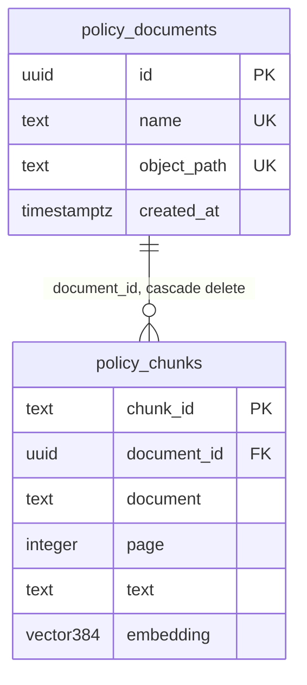
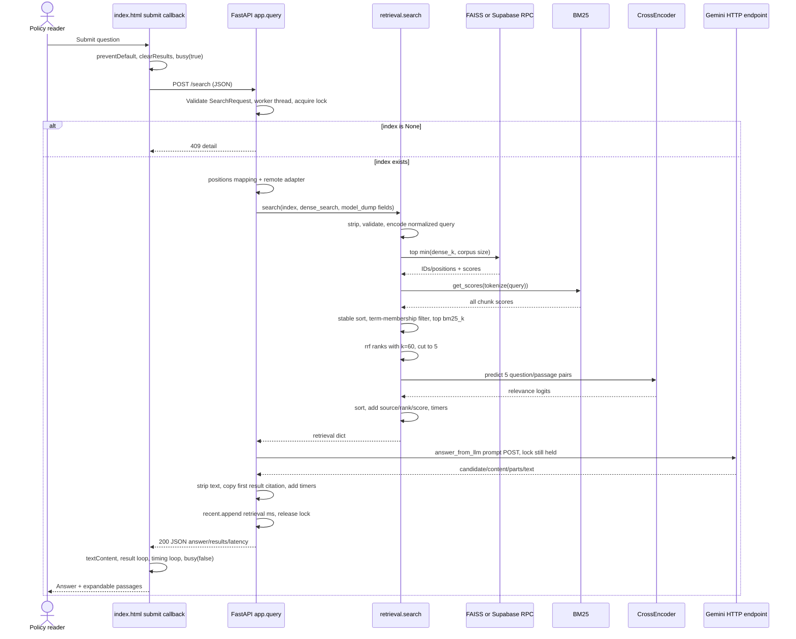
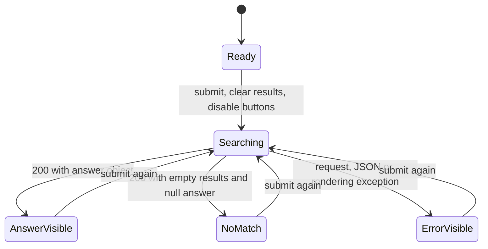

# HR Policy Finder: codebase mastery manual

Investigated 30 September 2026. Chapter 1 follows **Find answer**. This is a staged learning manual: startup and the system map provide orientation; the detailed lesson follows one query. Upload is explained as its prerequisite. Mock interview begins only on **START MOCK**.

## Evidence rules and verification boundary

- **CODE-VERIFIED:** Current application source, SQL definitions, frontend, Dockerfile, and installed FastAPI/Starlette/Uvicorn source were inspected.
- **RUNTIME-VERIFIED:** Nine existing ingestion/retrieval/evaluation checks passed with real cached CPU models. The existing API regression passed with real retrieval and simulated Gemini. Eight additional validation/provider-failure checks passed in an isolated local process.
- **SIMULATED:** Gemini transport and its answer were replaced in the API checks. No generated answer quality, provider availability, Supabase query result, deployed AWS state, or browser interaction was verified by those checks.
- **INFERRED / TECHNICAL INTERPRETATION:** Consequences and alternatives derived from the implementation, not evidence of the developer's intent.
- **ILLUSTRATIVE:** Hypothetical inputs or arithmetic examples. These are never described as runtime observations.
- **NOT VERIFIED FROM CODE:** The current AWS resource configuration and live deployment cannot be established from this repository. The existing project guide documents a prior AWS deployment; it is historical documentation, not current deployment evidence.

The reproducible trace is [verify-workflow.py](</Users/siddhunangadi/rag system/docs/verify-workflow.py>). Its observed values, actual outgoing prompt, intermediate dense/BM25/fused rankings, cross-encoder pairs/scores, response and errors are saved in [workflow-runtime-evidence.json](</Users/siddhunangadi/rag system/docs/workflow-runtime-evidence.json>). The script uses the fictional PDF, forces local indexing, and replaces provider transport. It does not modify production documents or the saved benchmark.

```sh
cd '/Users/siddhunangadi/rag system'
HR_LOCAL_ONLY=1 HF_HUB_OFFLINE=1 .venv/bin/python -m unittest test_system.IngestionTests test_system.RetrievalTests test_system.EvaluationTests -v
.venv/bin/python docs/verify-workflow.py
```

Warnings observed: urllib3 reports the local Python's LibreSSL compatibility issue; FAISS bindings report deprecations. The executed checks still passed. Their passing does not establish production reliability.

## 1. Start with the real entry point

**CODE-VERIFIED:** There is no `main()` in `app.py` and no frontend build step. The server command imports an already-created Python application object.

```text
Local command: uvicorn app:app --host 127.0.0.1 --port 8765
Container command: uvicorn app:app --host 0.0.0.0 --port 8000
     ↓
Uvicorn resolves module "app", attribute "app"
     ↓
Python executes app.py top-level imports
     ↓
retrieval.py sets default HF_HOME, imports models/Torch/httpx/FAISS,
sets Torch thread count (default 4), defines pinned model loaders
     ↓
app.py creates ROOT, index=None, recent=deque(maxlen=100), lock=Lock()
     ↓
FastAPI(lifespan=lifespan, docs_url=None, redoc_url=None, openapi_url=None)
     ↓
Decorators register five HTTP routes
     ↓
Uvicorn sends lifespan.startup → app.lifespan()
     ↓
embedding_model() loads pinned SentenceTransformer on CPU
     ↓
reranker() loads pinned CrossEncoder on CPU, max_length=512
     ↓
storage.enabled(): is HR_LOCAL_ONLY unset/empty AND are URL/key present?
     ├─ false → index stays None
     └─ true → load_chunks() → zero chunks: index stays None
                            → chunks exist: build_index(chunks, embed=False)
     ↓
yield → startup complete → Uvicorn begins serving HTTP
```

Sources: [app.py:17](</Users/siddhunangadi/rag system/app.py:17>), [lifespan:23](</Users/siddhunangadi/rag system/app.py:23>), [retrieval.py:9](</Users/siddhunangadi/rag system/retrieval.py:9>), [Dockerfile](</Users/siddhunangadi/rag system/Dockerfile>).

Framework mechanism was checked locally: `uvicorn/importer.py::import_from_string()` splits at `:`, calls `importlib.import_module()`, then `getattr()`. Uvicorn startup awaits the ASGI lifespan handshake. Starlette enters the configured async context manager; reaching its `yield` permits `lifespan.startup.complete`. Startup failures prevent normal serving; the project adds no retry around model loading or chunk loading.

The decorators execute on import; their handler bodies execute later on requests. `lru_cache(maxsize=1)` means each no-argument model loader reuses the same object in that process. Separate processes have separate models/indexes/locks. The async lifespan calls blocking model loading and HTTP synchronously during startup.

`storage.setting(name)` reads the neighboring `.env`, splits noncomment `key=value` lines, then gives the environment variable precedence. This is a small parser, not dotenv: quoted values and inline comments are not specially interpreted. Settings are reread on calls. Any nonempty `HR_LOCAL_ONLY`, including the literal string `"0"`, disables cloud mode. Existing secrets were not printed.

**Interview explanation:** “Uvicorn imports the `app` object from `app.py`; the lifespan loads two cached CPU models and optionally reloads Supabase chunks to rebuild local BM25. Readiness means initialization reached `yield`; it does not mean Gemini credentials or generation were checked.”

## 2. What the application actually does

**CODE-VERIFIED:** HR Policy Finder accepts text-based HR PDFs and answers a single policy question using retrieved passages. The page offers PDF upload, a question box, three example-question buttons, an answer, expandable supporting passages, and timing. Example buttons only fill/focus the question; they do not submit it.

Intended users are policy readers/HR staff (**INFERRED** from the UI and fixture). The problem is locating a rule when the user's words may differ from the document's terms. Inputs are PDF bytes and a question. Outputs are generated text, ranked original excerpts, document/page metadata and server timings. The code does not adjudicate benefits or apply a policy to an authenticated employee profile.

Verified workflow map:

```text
Start server → GET / → load CSS and register JavaScript handlers
                        → GET /metrics → show corpus count
Upload policy → POST /upload → parse/chunk/index/store → GET /metrics
Find answer → POST /search → retrieve/fuse/rerank → Gemini → render
Expand supporting passages → native <details> toggles; no new API
Open Search timing → native <details> toggles; no new API
Engineering use → call /search with other ranking modes/limits
Offline evaluation → evaluate.py command → benchmark JSON
```

No login/logout, authentication dependency, chat history, agent/tool routing, classifier, background queue, or user/tenant database exists in the inspected application. Retrieval `mode` is a caller-supplied enum; it is not learned model routing. No Pinecone client/import exists. Dense storage is FAISS locally or Supabase pgvector remotely.

**Interview explanation:** “This is a stateless question-answering interface over a shared document corpus. It combines retrieval and generation, but has neither conversational memory nor a trained routing classifier.”

## 3. The real component and call map

Paths below are relative to `/Users/siddhunangadi/rag system`; symbols are actual source names. Each row names its input, output, caller and callees.

| Component / symbol | File | Input → output | Caller → important callees / responsibility |
|---|---|---|---|
| Browser `$`, `api`, `busy`, `clearResults` | `templates/index.html:50–66` | IDs/request options/state flags → DOM nodes/JSON/DOM updates | Form callbacks → `getElementById`, `fetch`, `response.json`; shared UI operations |
| `refreshCorpus` | `templates/index.html:68` | none → updated corpus/status text | Initial script + upload callback → `api('/metrics')` |
| Search submit callback | `templates/index.html:85` | submit event + input value → rendered answer/passages/timing | User → `clearResults`, `busy`, `api('/search')`, DOM construction |
| Upload submit callback | `templates/index.html:76` | submit event + PDF → readiness text | User → `FormData`, `api('/upload')`, `refreshCorpus` |
| `lifespan` | `app.py:23` | application → initialized process state | ASGI startup → model loaders, `cloud_enabled`, `load_chunks`, `build_index` |
| `SearchRequest` | `app.py:38` | JSON fields → validated model | FastAPI body parser → Pydantic; supplies defaults/bounds |
| `home`, `stylesheet` | `app.py:49,54` | HTTP request → file response | Router → `FileResponse` |
| `upload` | `app.py:59` | UploadFile, size, overlap → document/counts dict; new global index | Router → `chunk_pdf`, model loader, `build_index`, `save_document`; lock protects publish |
| `query` | `app.py:90` | SearchRequest → answer/results/timings dict | Router → `cloud_enabled`, `search`, `answer_from_llm`; cloud adapter calls `dense_search` |
| `metrics` | `app.py:112` | none → corpus counts/recent retrieval statistics/benchmark summary | Browser/operator → benchmark file read, NumPy statistics under lock |
| `chunk_pdf` | `ingest.py:8` | bytes/name/tokenizer/window/overlap → list of chunk dictionaries | Upload, evaluator, tests → PdfReader, regex, tokenizer offsets, SHA256 |
| `embedding_model`, `reranker` | `retrieval.py:29,34` | none → cached model instances | Startup/index/search → pretrained CPU model constructors |
| `tokenize` | `retrieval.py:38` | string → lowercase Unicode word-token list | `build_index`, `search` → regex `\w+` |
| `build_index` | `retrieval.py:42` | chunks + embed boolean → `(chunks, FAISS-or-None, BM25)` | Startup/upload/evaluator/tests → tokenizer, embedding encode, FAISS, BM25Okapi |
| `rrf` | `retrieval.py:59` | two lists of `(position,score)`, k → fused ordered pairs | `search`, tests → dictionary accumulation + deterministic sort |
| `search` | `retrieval.py:67` | question/index/mode/limits/optional remote callback → retrieval dict | API/evaluator/tests → encode, FAISS or callback, BM25, `rrf`, CrossEncoder.predict |
| `answer_from_llm` | `retrieval.py:120` | question + ranked results → answer dict or None | API + one direct test → setting, `httpx.post`; no retrieval inside it |
| `setting`, `config`, `enabled` | `storage.py:8,17,21` | name/env/file → string or cloud-mode boolean | Storage + API + generation → local environment/file reads |
| `request` | `storage.py:26` | HTTP method/path/options → httpx Response | Storage helpers → `httpx.request`, server-only credential headers |
| `load_chunks` | `storage.py:36` | none → chunk list without embeddings | Startup → paginated Supabase table GETs |
| `save_document` | `storage.py:47` | name/PDF/chunks/vectors → no explicit return; remote writes | Upload → object POST, replacement RPC POST |
| `dense_search` | `storage.py:55` | 384 floats + limit → rows with ID/similarity | API's callback → match RPC POST |
| `replace_policy_document`, `match_policy_chunks` | `supabase.sql` | replacement JSON / vector & count → void / ID-score rows | Supabase RPC boundary → SQL statements described below |
| `quality`, `run` | `evaluate.py:17,32` | result labels / CLI args → metrics / benchmark file | Tests / CLI → ingest/index/search, randomization, statistics, atomic file replace |
| Container startup | `Dockerfile` | image + environment → Uvicorn on port 8000 | Container runtime → app import/lifespan |

Frontend and backend are served by the same FastAPI process. They are separate code responsibilities, not separate frontend/backend deployments established by this source. No middleware is added by project code; default framework error/exception machinery is present. No explicit `Depends()` or security check appears on the routes.

## 4. How the corpus exists before Find answer

This prerequisite explains what the query reads. It does not require a fresh upload for every query when cloud startup loaded saved chunks.

**CODE-VERIFIED:** The upload callback prevents native navigation, disables all buttons, sets “Reading your policy…”, then passes `new FormData(event.target)` to `POST /upload`. The only named form field is `file`; the browser constructs the multipart boundary. No custom upload Content-Type is supplied. FastAPI supplies defaults `chunk_size=400`, `overlap=60`.

`upload()` reads at most 20 MiB + 1 byte to detect overflow. It derives a filename using `Path(...).name[:200]`, checks its `.pdf` suffix, and acquires the shared lock. `chunk_pdf()` then:

1. Requires `32 <= chunk_size <= 500` and `0 <= overlap < chunk_size`.
2. Requires `%PDF-` at the start of the byte stream.
3. Opens `PdfReader(io.BytesIO(data))`; encrypted or >300-page documents fail. Parse exceptions become a friendly ValueError.
4. Extracts each page's text or an empty string; collapses all whitespace to single spaces and strips ends. Rejects >2 million total extracted characters.
5. Computes a 16-hex SHA256 prefix from **filename bytes plus PDF bytes**. This is not content-only deduplication.
6. For each page (numbered from 1), tokenizes with no special tokens, requesting offsets. `word_ids()` tracks subword pieces belonging to a word.
7. Sets `end=min(start+chunk_size, len(offsets))`; backs `end` up if it would split a word. If no whole word fits, fails.
8. Takes the original normalized text substring between token character offsets. Adds `{chunk_id, document, page, text}`; ID is `prefix:page:start_token_offset`.
9. If page is finished, breaks. Otherwise starts near `end-overlap`, ensures progress with `max(start+1, ...)`, shifts to word boundaries, and loops. Approximate overlap may differ from exactly 60 tokens because of those shifts. Chunks never span pages.
10. Rejects an all-empty corpus. There is no OCR.

**RUNTIME-VERIFIED:** The supplied `hr_policy.pdf` created 24 chunks with 400/60 defaults. The first ID was `48d886cee55bcee2:1:0`; its text contains “Employees receive 20 working days of annual leave each calendar year.” The fixture is explicitly fictional. Do not generalize its benefit values to a real organization.

`previous` keeps existing chunks with a different filename. The same filename replaces all its previous chunks; a new filename adds documents. If total chunks would exceed 5,000, upload fails. `build_index(previous+incoming, embed=not cloud_enabled())` creates the proposed replacement before publishing it:

- Both modes tokenize every chunk and create a new `BM25Okapi(tokens)`.
- Local mode embeds **all** replacement chunks, normalizes vectors and adds them to `faiss.IndexFlatIP(384)`.
- Cloud mode creates no local FAISS index. It embeds **incoming** chunks, then writes the PDF and calls the database replacement RPC.

Only after these calls succeed does `index = replacement` occur; then `recent.clear()`. ValueError maps to HTTP 400; RuntimeError maps to 503. Other exception types are not caught here. An object upload can succeed before a later database failure, so preserving local state does not imply all remote writes roll back.

Response shape (observed locally):

```json
{"document":"hr_policy.pdf","chunks":24,"total_chunks":24,"chunk_size":400,"overlap":60}
```

The browser clears old search results, awaits `/metrics`, reenables buttons, and announces the filename is ready. A failed metrics refresh after a successful upload is caught by the same handler, so the UI can display an error even though indexing succeeded.

**Interview explanation:** “I chunk per page using the embedding tokenizer's character offsets, so stored passages retain original wording. Filename replacement is intentional, overlap is approximate at word boundaries, and local publication follows successful ingestion. Object storage and database replacement are separate atomicity boundaries.”

## 5. Workflow 1: watch Find answer execute

### A. The event and exact HTTP input

At this moment the corpus is ready and the user has typed `How many annual leave days do I get per year?`. This string was used in the local runtime check, not invented as a purported provider result.

The “Find answer” button submits `#search-form`; Enter in the input can do the same. Native `required`/`maxlength=500` supply browser constraints. Whitespace is not an empty string, so server-side stripping still matters.

Execution enters the anonymous async submit callback at [index.html:85](</Users/siddhunangadi/rag system/templates/index.html:85>). It calls, in this exact order:

1. `event.preventDefault()` stops native form navigation.
2. `clearResults()` removes result list children, hides answer/passages/timing, closes disclosures, shows the introductory empty message. Old answer text can remain in hidden nodes until overwritten; it is not displayed.
3. `busy(true, 'Finding relevant passages…')` disables **all buttons**, writes status and clears the error class. Inputs are not disabled.
4. Reads `$('question').value` and constructs the following request.

```http
POST /search
Content-Type: application/json

{"query":"How many annual leave days do I get per year?","mode":"rerank","candidate_count":5,"final_k":5}
```

`JSON.stringify` converts the object to a JSON string. `api()` awaits `fetch()`, then `response.json()`, then checks `response.ok`. Project JavaScript supplies no Authorization header or request timeout/cancellation. Browser-default headers are not explicitly specified by this code.

### B. Route matching and validation happen before your handler

The ASGI server supplies HTTP method/path/body to the app. Starlette's router tests registered routes and accepts the full path-and-method match for `POST /search`. A wrong HTTP method is not a call to `query()`; a missing route is not matched.

FastAPI's installed request handler reads JSON because Content-Type is application/json, resolves request fields and validates `SearchRequest`. Only valid input reaches `query(request)`. The function is synchronous (`def`), so FastAPI awaits its execution in a worker thread via `run_in_threadpool`. This does not make its internal dense/BM25/Gemini operations parallel.

Expanded model at the boundary:

```python
SearchRequest(
    query='How many annual leave days do I get per year?', mode='rerank',
    dense_k=20, bm25_k=20, candidate_count=5, final_k=5, rrf_k=60
)
```

All limits are integers bounded 1–100. Query is required, length 1–500; mode allows dense/bm25/rrf/rerank. Defaults are created during model validation, not filled in by the browser. UI cutoff=5 overrides the API default cutoff=10. Unknown fields use the model's default handling; no project `extra='forbid'` is configured.

Malformed JSON or invalid model fields yield FastAPI 422 with a `detail` list. No authentication dependency runs. No custom response model is declared.

### C. `app.query()` acquires state and chooses dense storage

Execution is now at [app.py:90](</Users/siddhunangadi/rag system/app.py:90>).

1. Acquires `lock`. If another upload/search/metrics call holds it, this call waits. Queue time is not measured by `search()`.
2. If `index is None`, raises HTTP 409 “Upload a policy PDF first.” No retrieval or Gemini call follows.
3. Builds `positions={chunk_id: list_position}` from `index[0]`. This maps remote stable IDs to the local text list and is built even in local mode.
4. Calls `cloud_enabled()`. False sets `remote=None`. True creates a lambda that calls `storage.dense_search(vector,limit)`, converts each returned similarity to float, maps IDs through `positions`, and drops IDs absent from the local snapshot. It does not replace dropped rows with more results.
5. Calls `search(index=index, dense_search=remote, **request.model_dump())`.

The index tuple is `(chunks, local_FAISS_or_None, BM25_object)`, not a database connection. Local mode uses FAISS; cloud mode uses a remote callback and the same in-process BM25. A changing configuration/corpus can make the tuple and selected storage path inconsistent; no corpus version protocol exists.

### D. `retrieval.search()` validates and initializes timers

At [retrieval.py:67](</Users/siddhunangadi/rag system/retrieval.py:67>), `started=perf_counter()` begins retrieval timing. `query.strip()` removes leading/trailing whitespace. Empty/overlong input, invalid mode/limits, or `mode=='rerank' and final_k>candidate_count` raises ValueError. The API converts it to 422.

`chunks,dense,lexical=index` unpacks state. Five stage timers begin as 0.0. `ranked=[]` is later filled by the selected path. Model scores do not exist until their respective stage runs.

### E. Query embedding, then dense retrieval

For rerank mode, `mode!='bm25'` is true. The cached embedding model receives **a list containing the stripped string**, not the PDF and not Gemini's prompt:

```python
vector = embedding_model().encode([query], normalize_embeddings=True,
                                  show_progress_bar=False)
```

**RUNTIME-VERIFIED:** Shape `[1,384]`, dtype `float32`. The 384 coordinates are a learned numeric representation, not word IDs, page numbers or a generated answer. The evidence file records the first eight actual coordinates. Both document and query embeddings use the same pinned model and normalization.

With no remote callback: `dense.search(vector,min(20,len(chunks)))` returns arrays of inner-product scores and integer corpus positions. With unit-normalized vectors, inner product expresses cosine similarity. `IndexFlatIP` is an exact local search. The code converts array pairs to ordinary Python `(int,float)` tuples.

With a remote callback: `vector[0].tolist()` gives a list of 384 Python numbers, and the limit is still capped by local chunk count. Storage serializes that vector to pgvector's bracketed string and POSTs the match RPC. Actual SQL and result mapping are in section 7. No remote call occurred in our local verification.

Dense retrieval does not check a minimum similarity or whether the question is answerable. It returns nearest chunks even for an unrelated question when the corpus is nonempty.

### F. BM25 lexical scoring executes next

Because `mode!='dense'` is true, the same stripped query goes to `tokenize()`:

```python
['how','many','annual','leave','days','do','i','get','per','year']
```

This representation is lowercase regex words. It is different from the embedding model's WordPiece tokens; there is no stemming, synonym expansion or stopword removal.

`lexical.get_scores(terms)` produces one BM25 score per corpus chunk, using corpus term frequencies/length statistics prepared during `build_index()`. NumPy sorts positions by descending score with stable tie ordering. For each sorted chunk, the comprehension keeps it only if **any query term occurs in `lexical.doc_freqs[i]`**, then caps at 20. Zero or negative scores are retained if terms match; this is necessary in tiny corpora. The existing one-chunk regression confirms that behavior.

Dense and BM25 happen sequentially. They contribute independent rankings but are not concurrent tasks. Dense/BM25 scores have incompatible scales.

### G. RRF combines ranks, not scores

`mode in ('rrf','rerank')` is true. `rrf(ranked,lexical_ranked,60)` creates `scores={}`. Its outer loop visits dense then lexical rankings; its inner loop enumerates positions starting at rank 1. Each hit adds `1/(60+rank)` to that chunk position's sum. Original similarity/BM25 magnitudes are discarded. Sorting uses `(-fused_score,chunk_position)`.

**ILLUSTRATIVE arithmetic:** a chunk ranked dense #1 and lexical #2 receives `1/61+1/62≈0.032522`; a dense-only #1 receives `1/61≈0.016393`. This example is arithmetic, not an observed ranking assignment. Actual lists are recorded under `stages` in the evidence file.

This is a union of candidates with contributions from each list, not an average embedding or concatenation of scores. `rrf_k=60` dampens rank differences; it does not mean return 60 passages.

### H. Five candidates enter the cross-encoder

`mode=='rerank'` is true. `ranked=ranked[:candidate_count]` cuts the fused list **before** expensive model scoring. `actual_candidates=len(ranked)` records how many survived (possibly less than five in a smaller corpus).

The existing CrossEncoder receives a list of `(query, chunks[position]['text'])` pairs through `.predict(...,show_progress_bar=False)`. It jointly reads question and passage; it does not compare two cached embeddings. Its configured maximum sequence length is 512; long combined input may be truncated. Chunking at 400 is not a proof every 500-character question plus passage fits.

Outputs are raw relevance logits. Scores are converted to float, paired with corpus positions, then sorted descending with position as a tie breaker. Negative logits are not automatically removed. No confidence threshold or learned model router is applied.

**RUNTIME-VERIFIED:** For the annual-leave question, the five returned page numbers were `[1,2,3,19,18]`. Page 1 ranked first; its observed logit was approximately 6.0070. Precise observed pairs/scores are in the evidence JSON. Scores can vary across platforms; they are not confidence percentages.

Since the UI reranks five and returns five, reranking changes **ordering** but cannot change membership of that five-candidate pool. It can improve MRR/nDCG, not recover a sixth candidate excluded at the cutoff. No page deduplication occurs in live results; multiple chunks from the same page can consume result slots.

### I. Retrieval becomes a plain response object

For each ranked pair in `ranked[:final_k]`, `dict(chunks[i],rank=rank,score=score)` copies source fields and adds 1-based rank and the final stage's score. The return value contains:

```python
{
  'query': stripped_query,
  'results': [{'chunk_id': ..., 'document': ..., 'page': ..., 'text': ...,
               'rank': 1, 'score': ...}, ...],
  'latency': {'query_embedding_ms': ..., 'dense_search_ms': ...,
              'bm25_search_ms': ..., 'rrf_ms': ..., 'rerank_ms': ...,
              'total_retrieval_ms': ...},
  'mode': 'rerank', 'candidate_count': 5,
  'score_type': 'cross_encoder_logit'
}
```

Ellipses mark schema placeholders, not measured values. `search()` does not generate an answer, call Gemini, save query history or write the database. Disabled timers remain zero. `candidate_count` is zero in non-rerank modes even when retrieval found candidates; it specifically counts reranked candidates.

### J. Generation is a separate call inside the same lock

Execution returns to `app.query()`. It starts a separate timer and calls `answer_from_llm(result['query'],result['results'])` while still holding the global lock.

At [retrieval.py:120](</Users/siddhunangadi/rag system/retrieval.py:120>):

1. Empty `results` returns None without checking a key or contacting Gemini.
2. Looks up `GEMINI_API_KEY`; absent key raises RuntimeError.
3. Builds `context` from `results[:5]`, numbering text blocks `Passage 1:` through at most `Passage 5:`, joined by blank lines. Embeddings, scores, filename, page and chunk IDs are **not included**.
4. Builds this exact instruction prefix, then the question and context:

```text
Answer the policy question in one or two short sentences. Use only the passages below. If the answer is absent, say: "I couldn't find this in the policy."

Question: How many annual leave days do I get per year?

Passage 1: [the actual original retrieved text]

Passage 2: [the next original retrieved text]
...
```

The prefix/question above are actual constructed input; bracketed text is a placeholder for this abbreviated display. The full actual prompt is saved in the evidence file.

5. Performs synchronous `httpx.post`:

```http
POST https://generativelanguage.googleapis.com/v1beta/models/gemini-flash-lite-latest:generateContent?key=<server-secret>
Content-Type: application/json

{
  "contents": [{"parts": [{"text": "<full prompt>"}]}],
  "generationConfig": {"maxOutputTokens": 100, "temperature": 0}
}
```

The API key is a URL query parameter, not a browser header. It stays server-side in this implementation. Timeout is 30 seconds using httpx timeout semantics, not a verified 30-second end-to-end deadline. No project retry/backoff/fallback exists. The `latest` alias is not a pinned generation revision.

6. `response.is_error` raises RuntimeError with the provider's HTTP status. Success reads `response.json()['candidates'][0]['content']['parts'][0]['text'].strip()`. Only the first text part of the first candidate is used; no streaming, tool calls, structured output or verification loop.
7. Returns `dict(text=text,document=results[0]['document'],page=results[0]['page'])`.

**Critical boundary:** The answer's citation is assigned by Python from result 1. The model never returns a validated source ID and did not receive page metadata. It can use a different passage while the UI still displays the first passage's page. Prompt instructions/temperature zero do not establish correctness or citation support.

**SIMULATED runtime response:** The trace transport returned a valid provider-shaped JSON containing `SIMULATED GEMINI RESPONSE — not an observed model answer.` This verifies parsing, assignment and API wiring; it is not a generated annual-leave answer or an accuracy result.

### K. API finishes and browser updates

`query()` adds `answer`, `answer_generation_ms` and `total_response_ms` (retrieval time plus generation time) to the result. It appends **retrieval time only** to the bounded `recent` deque, returns the dict, and releases the lock. Failure before this append does not count as a successful recent search.

FastAPI serializes the returned ordinary Python structures to a JSON response (default HTTP 200). There is no declared response schema validator. These timers omit lock waiting, model startup, some handler preparation, response serialization, network transit and DOM rendering. Simulated generation timing is not provider latency.

`api()` awaits JSON and returns it to the submit callback. With a successful normal response:

1. If `data.answer` is truthy, fills `#answer-text` and `#answer-source` via `textContent`, then unhides `#answer`.
2. Loops through `data.results`; creates an `li`, native `details`, `summary` with filename/page and a `p` containing source text. Appends them to `#results`.
3. Clears `#timings`; loops over retrieval/generation/total timing keys; creates DOM groups and formats milliseconds with `.toFixed(2)`.
4. Shows timing disclosure; hides the empty message iff an answer object exists; hides passages iff there are zero results. Sets the supporting passage count.
5. Calls `busy(false, 'Your answer is ready. Review the supporting passages below.')`.

There is no React state store or component rerender. Explicit DOM mutations change what the browser paints. `textContent` prevents retrieved/generated strings becoming HTML markup; it does not protect the LLM from malicious document instructions.

**CODE-VERIFIED UI edge:** An empty result response has `answer=None`; the UI shows the no-matching-passage message but still sets the success status “Your answer is ready.” An empty string in a truthy answer object is also not specially rejected. Browser execution was not performed in this investigation.

## 6. All retrieval branches and their decisions

| Condition in `search()` | True path | False path / what happens next |
|---|---|---|
| stripped query empty or >500 | ValueError → API 422 | Validate mode and numeric limits |
| unknown mode or invalid limit | ValueError → API 422 | Check rerank cutoff constraint |
| rerank and final_k > candidate_count | ValueError → API 422 | Unpack index |
| mode != bm25 | Embed question then local/remote dense | Skip embedding/dense; zero timers |
| remote callback exists | RPC → map IDs, discard absent local IDs | FAISS inner-product search |
| mode != dense | tokenize/BM25 score/sort/membership filter | Skip lexical stage |
| any query token occurs in chunk | Keep lexical hit regardless of score sign | Exclude lexical hit |
| mode == bm25 | ranked becomes lexical list | Keep current dense list for later fusion |
| mode in rrf/rerank | Sum rank contributions | No fusion |
| mode == rerank | Cut pool, score pairs, sort logits | No cross-encoder call |
| results empty in generation | return None | Check key, construct prompt, POST |
| Gemini HTTP error | RuntimeError → API 503 | Parse first candidate/part |
| model output lacks expected nested fields | KeyError/IndexError/TypeError → RuntimeError → 503 | Strip text, attach first-result citation |

Even dense-only or BM25-only API search calls Gemini afterward if results exist. The evaluator bypasses `app.query()` and calls `search()` directly, so it never generates answers.

## 7. Database execution, not just “accessing storage”

**CODE-VERIFIED definition; NOT RUNTIME-VERIFIED remotely.**

### Schema and relationships



Original PDF bytes live in a private Supabase Storage bucket, not in the chunks table. Each chunk's duplicated `document` filename is used by Python/UI. SQL defines a cosine HNSW index on the 384-dimensional embedding. Defining an index does not prove a live query plan uses it, nor establish measured approximate-search recall.

### Startup read

`lifespan → load_chunks → request('GET', '/rest/v1/policy_chunks?select=chunk_id,document,page,text&order=document.asc,chunk_id.asc')`. `Range` header starts `0-999`, advances by the returned batch length, and stops when a batch contains fewer than 1,000 rows. Embeddings and document IDs are not selected; chunk text feeds BM25 and generation. There is no project-wide transaction across paginated reads and no subsequent polling/background synchronization.

### Dense lookup during the question

`query`'s lambda → `storage.dense_search(vector,limit)` → `request('POST','/rest/v1/rpc/match_policy_chunks',json=...)`.

```json
{"query_embedding":"[<384 comma-separated coordinates>]","match_count":20}
```

This is an abbreviated schema example. The Python wrapper adds `apikey` and `Authorization: Bearer <service-role-key>` headers and a 30-second httpx timeout. Expected response is a list of `{chunk_id,similarity}` rows, not full passage text.

The SQL function executes:

```sql
select chunk_id, (1 - (embedding <=> query_embedding))::real
from policy_chunks
order by embedding <=> query_embedding
limit match_count;
```

`<=>` is cosine distance; `1-distance` becomes reported similarity. No document, tenant, page, date or minimum-score predicate is present. The API maps returned IDs to its local list, then `search()` combines those positions with local BM25 positions. Stale IDs can vanish during that mapping.

### Write during upload

`save_document(name,data,incoming,vectors)` first POSTs raw PDF bytes to `/storage/v1/object/policy-pdfs/<URL-quoted-name>` with `Content-Type: application/pdf` and `x-upsert: true`. It then zips each incoming chunk/vector into JSON rows, with vector serialized as a bracketed string, and POSTs `/rest/v1/rpc/replace_policy_document`:

```json
{"p_name":"hr_policy.pdf","p_path":"policy-pdfs/hr_policy.pdf","p_chunks":[{"chunk_id":"...","document":"hr_policy.pdf","page":1,"text":"...","embedding":"[...]"}]}
```

The PL/pgSQL function deletes the old `policy_documents` row by filename (cascade removes its chunks), inserts a new document row and captures its UUID, then inserts all supplied chunks referencing that UUID using `jsonb_array_elements`. These database changes are in the database function's transaction. They do not roll back the preceding Storage object POST. There is no ORM or direct SQL connection in Python.

The supplied SQL revokes table access from `anon`/`authenticated` and limits RPC execution to `service_role`. This protects direct database paths; FastAPI still has no user authentication and exposes a shared corpus to whoever can reach it.

**Interview explanation:** “The database returns IDs and cosine scores; passage text comes from the process snapshot. That saves an extra text fetch but creates a consistency requirement between local BM25/text and remote rows. Replacement is transactional inside PostgreSQL, while PDF object storage is a separate operation.”

## 8. Error paths you can mentally execute

| Origin | Who receives/catches it | HTTP / what the user sees | Evidence |
|---|---|---|---|
| Missing field, invalid enum/limit/JSON | FastAPI validation before handler | 422 detail list; `api()` uses generic “Check the input values and try again.” | Model + framework source; enum/limit runtime checks |
| whitespace query | `search()` ValueError → `query` | 422 detail string; UI displays “Enter a question of 1–500 characters.” | Runtime |
| final_k exceeds candidate_count | `search()` ValueError → `query` | 422 explanatory string | Runtime |
| no index | `query` raises HTTPException | 409 “Upload a policy PDF first.” | Existing API regression with stubbed generation |
| invalid PDF | `chunk_pdf` ValueError → upload catch | 400; UI displays detail | Real ingestion/API tests |
| oversize upload | upload before lock | 413; friendly size message | Code only in this investigation |
| missing Gemini key | `answer_from_llm` RuntimeError → query catch | 503 “Gemini is not configured.”; retrieved result is not returned | Runtime with missing-key injection |
| provider 429 or other error status | generation raises RuntimeError → query | 503 “Gemini request failed (429).”; no retry | Runtime with simulated 429 |
| missing candidates/parts | generation catches KeyError/IndexError/TypeError | 503 “Gemini returned no answer.” | Runtime with simulated missing candidates |
| Gemini transport timeout | httpx.ReadTimeout bypasses both application catches | Default 500; tested response was text/plain `Internal Server Error` | Runtime with injected timeout |
| provider non-JSON success body | JSON decode ValueError reaches `query`'s ValueError catch | Misleading 422 rather than provider failure | Code-derived; not separately exercised |
| provider text is nonstring | `.strip()` may raise AttributeError, not caught there | Unhandled 500 | Code-derived |
| provider text is empty string | `.strip()` returns empty text, accepted | HTTP 200 answer object; empty answer content | Code-derived |
| Supabase error status | `storage.request` RuntimeError → upload/query catches | 503; startup has no local catch and fails readiness | Code only; no live remote failure injection |
| Supabase transport exception | Not caught by `request` or handlers | Unhandled request error / startup failure | Code-derived |
| malformed benchmark JSON | `metrics` has no catch | Metrics fails; page startup reports inability to reach server | Code-derived |
| unrelated query with nonempty corpus | No answerability threshold | Nearest passages still go to Gemini; absence response is prompt-only | Code-derived |
| browser network/JSON parse/DOM exception | Form callback's catch | Reenables buttons, displays `error.message`, adds status error class | Frontend source only |
| authentication failure | No authentication boundary exists | No project login/401/403 flow to trace | Source absence |

For the observed plain-text 500, `api()` tries `response.json()` **before** checking status, so the browser would take its JSON-parse exception path rather than display the backend's plaintext message. Exact browser-native error wording is NOT VERIFIED. Previously displayed answers were already hidden at submission. There is no UI fallback showing retrieved passages when Gemini fails, even if retrieval completed successfully. No request retry, circuit breaker or alternate LLM is implemented.

**Interview explanation:** “I distinguish handled HTTP service failures from transport failures. The former become 503; the latter currently escape to 500. Generation is mandatory for a successful nonempty API result, so there is no retrieval-only fallback on provider failure.”

## 9. Runtime sequence and UI state



External responses in this diagram describe the code contract; the local run simulated Gemini and chose FAISS.



These are conceptual names for DOM combinations, not enums/classes in the implementation.

## 10. Why the current technologies are here

“DOCUMENTED DESIGN DECISION” below means the existing decision log contains that rationale; it does not prove a comparison was experimentally settled. Alternatives are **TECHNICAL INTERPRETATION**, not claims the developer rejected them.

| Technology / what | Why/how used here | If removed | Alternative and trade-off |
|---|---|---|---|
| FastAPI + Pydantic: HTTP router and input validator | Decorators bind paths; SearchRequest validates/defaults JSON. Minimal direct handlers | No current HTTP boundary/validation; must replace both | Flask plus explicit validation is possible; migration must preserve contracts/errors. Framework preference is interpretation |
| Uvicorn: ASGI server | Imports app object, drives lifespan, accepts HTTP | App object alone does not listen | Another ASGI server can replace serving; startup/worker settings matter |
| Vanilla HTML/JS + native details | Small same-origin UI, direct DOM text and disclosures | API remains, browser workflow disappears | React adds build/state conventions useful at greater UI complexity; no necessity established here |
| pypdf: text PDF parser | Extracts page text before normalization | No upload text ingestion | Layout-aware/OCR parser could address scans/tables; more dependencies and different provenance behavior |
| SentenceTransformer: pretrained text-to-vector model | Pinned multi-qa-MiniLM-L6-cos-v1, CPU, normalized 384 floats | Dense branch cannot operate | BM25-only removes semantic branch; another encoder requires reembedding existing vectors and possibly changing SQL dimension |
| FAISS IndexFlatIP: local exact vector index | Local indexing and evaluator; omitted from production requirements | Local dense flow fails without cloud configuration | NumPy dot product could be a small-corpus baseline; persistence/scaling behavior must be supplied |
| Supabase PostgreSQL/pgvector + Storage | Durable metadata/chunks/vectors/PDFs; REST RPCs | Cloud startup/search/write no longer work; local mode lacks restart persistence | Local persistence or standalone DB requires storage/recovery implementation; managed service adds network dependence |
| rank-bm25: lexical ranker | Exact term signal, local rebuilt corpus stats | Hybrid/rerank implementation must be adjusted to dense-only | Search service can add stemming/filtering/scale; extra service operations. Decision log justifies small local corpus |
| RRF: rank fusion formula | Adds rank contributions without score calibration | Must choose a single branch or another fusion | Weighted score fusion preserves magnitudes but requires compatible/calibrated scales; documented rank-fusion rationale |
| CrossEncoder: joint question/passage scorer | Pinned ms-marco-MiniLM-L6-v2 scores bounded fused pool | Keep fused order; saved dense baseline is already strong | Larger candidate pool costs inference; cannot recover candidates never retrieved. Five's rationale is documented fixture evidence |
| Gemini: hosted text generation | Direct httpx call using question + up to five passages | Current nonempty API search fails unless generation path changes | Passage-only display/extractive selection avoids provider calls but changes product behavior; another LLM requires API/output adaptations. Provider choice itself is not proved optimal |
| httpx: synchronous HTTP transport | Supabase and Gemini requests, timeout/status handling | Remote boundaries fail | Another HTTP client would still need credential/payload/error semantics; orchestration framework is unnecessary for the current straight call chain |
| One process + Lock | Serializes shared index/models and recent metrics; documented demo simplification | Unprotected reads/writes can interleave during replacement | Immutable snapshots plus bounded concurrency are a possible evolution; multiple replicas additionally need corpus synchronization |
| Docker: reproducible runtime recipe | Python 3.11 slim, CPU torch, runtime files, Uvicorn command | Local server remains; image-based run unavailable | VM/process deployment must supply Python/dependencies/startup; cost/operational superiority is not proved |

400-token/60-overlap defaults and page-local chunks are documented context/provenance choices, not measured universal optima. Overlap duplicates text and cannot carry conditions across page boundaries. Four Torch threads and CPU use are documented reproducibility choices, not a production throughput guarantee.

**Interview explanation:** “I used a small direct pipeline with pretrained models, rank fusion and bounded reranking. I can explain each stage's role, but model/framework selection is not an achievement of training or proof that alternatives are inferior.”

## 11. Deployment and runtime configuration: verified limits

The Dockerfile copies `app.py`, `ingest.py`, `retrieval.py`, `storage.py`, templates, static assets and `data/benchmark.json`. It does not copy tests, evaluation questions/PDF, `.env` or cached model weights. It installs CPU Torch 2.8.0 and production requirements, exposes 8000 and launches Uvicorn on all interfaces. No worker-count argument is supplied. Configured Supabase is necessary for dense indexing in that production image because FAISS is absent; without cloud configuration startup can still reach readiness with no index, but upload's local indexing will fail.

Model artifacts may download at container startup because the cache is not baked into the image. No local PDF is auto-ingested on startup. There is no health-check endpoint that tests every dependency; `/` just serves HTML. Gemini configuration is checked only after nonempty retrieval.

Existing `docs/project-guide.md` documents CloudFront → ALB → ECS Fargate and a previous live review. This session did not read current AWS resources or verify the public site. Treat that deployment chain, task count and ingress/TLS details as **DOCUMENTED HISTORICAL STATE / NOT VERIFIED FROM CODE**, not current fact. No IaC, ECS task definition, CloudFront policy or ALB configuration is checked into this inspected root. Nothing was deployed or changed externally during this study.

**Interview explanation:** “I can substantiate the container startup from Dockerfile. The repository guide records a prior AWS deployment, but current infrastructure state requires a live read; source code alone cannot prove the current task count or TLS topology.”

## 12. Evaluation versus live behavior

`evaluate.py` has its own CLI entry point under `if __name__=='__main__'`. It loads a labeled dataset, chunks its PDFs, validates page judgments, builds local FAISS/BM25, warms model paths, then shuffles jobs with seed 42 across dense/BM25/RRF/rerank-5/10/20. Every timed query recomputes query inference. It calls `search()` directly, not `/search`, so Gemini/cloud transport/lock waiting/UI are absent.

`quality()` credits relevant document-page pairs at their first occurrence only; duplicates have zero gain. Recall@5 measures labeled-page coverage, MRR@5 the reciprocal first relevant rank, and nDCG@5 graded discounted ranking. These are not generated-answer accuracy. The evaluator writes raw trials and metadata to a temporary file then replaces the output file.

The historical benchmark records 32 synthetic questions × 3 repeats × 6 settings. It was not rerun in this investigation. The current regression tests passed, but repeated questions do not become additional independent accuracy examples. `/metrics` loads that historical benchmark file even if users uploaded a different corpus; its live timing stats contain up to 100 successful **retrieval** times and are cleared on upload.

**Interview explanation:** “I measured retrieval separately from generation. Saved synthetic ranking metrics are not production answer accuracy or browser P95. Exact-number tests now check retrieved text, not Gemini's answer.”

## 13. Documentation discrepancies found

| Material | Historical claim | Current code |
|---|---|---|
| README introductory paragraph | Does not generate answers | `app.query → answer_from_llm → Gemini` generates |
| README answer-first update / decisions log | `answer_excerpt`, verbatim two-sentence selection | Function removed; Gemini input/output parsing at retrieval.py:120 |
| README answer timing | `answer_selection_ms` | `answer_generation_ms` |
| README architecture | Candidate selection 10 | UI sends 5; API default remains 10 |
| README no deployment infrastructure statement | No deployment | Dockerfile exists; guide documents prior AWS deployment; current live state unverified |
| Decisions log FAISS only offline | FAISS only historical evaluator | API uses FAISS too when cloud is disabled |
| Graphify graph | `query` calls `answer_excerpt` | Current source calls `answer_from_llm`; graph is stale |
| Earlier experiment exact-number checks | Assertions on displayed extractive answers | Current test checks phrase presence in retrieved chunks |

Existing historical files were preserved. This manual follows current source; the existing guide already identifies several historical inconsistencies.

## 14. Interview questions and strong answers, after the lesson

No quiz is being started here. These answers are study material drawn from the workflow. Each includes a follow-up for later mock mode.

**Level 1 — What happens after Find answer?**  
Concept: event-to-response orchestration. Mechanism: submit callback clears UI and sends JSON. Actual project/code: index.html:85 → app.query:90 → search:67 → answer_from_llm:120. Example: annual-leave question retrieves page 1 and other supporting pages. Why: retrieval provides evidence; generation condenses it. Trade-off: generation adds latency/dependency. Limitation: provider failure currently suppresses otherwise useful retrieved passages. Follow-up: which exact step acquires the lock?

**Level 2 — Where does the value 20 come from?**  
Concept: request defaults versus content. Mechanism: Pydantic gives dense_k/bm25_k defaults 20; the PDF separately contains “20 working days.” Actual code: SearchRequest at app.py:41–42; source phrase in retrieved page text. Example: UI does not send either top-20 field. Why: default candidate retrieval keeps the UI simple. Trade-off: top-20 coverage/cost and benefit quantity are unrelated. Limitation: a retrieval limit is not a policy answer. Follow-up: where do candidate_count=5 and rrf_k=60 originate?

**Level 2 — What crosses the dense-search boundary?**  
Concept: representation and IDs. Mechanism: a normalized 384-vector and limit; RPC returns chunk IDs/similarity. Actual code: search:83–87 → storage.dense_search:55 → match_policy_chunks SQL → app positions mapping. Example: local trace observed a float32 [1,384] array. Why: vectors permit semantic nearest neighbors. Trade-off: remote persistence adds network latency. Limitation: unknown remote IDs are discarded, with no refill. Follow-up: which copy supplies actual passage text?

**Level 3 — Why not add BM25 and dense scores directly?**  
Concept: incompatible scoring scales. Mechanism: RRF uses rank contributions. Actual code: retrieval.rrf:59. Example: dual #1/#2 hit gets 1/61+1/62. Why: avoids score calibration. Trade-off: loses score magnitude. Limitation: fusion does not guarantee improved quality; saved RRF-only ranking was below dense on the fixture. Follow-up: what happens on a fused-score tie?

**Level 3 — Can rerank-5 improve recall when final_k is 5?**  
Concept: candidate membership versus order. Mechanism: cut to five, score those pairs, return all five. Actual code: search:109–114. Example: [1,2,3,19,18] is an ordered five-member set in the trace. Why: reduce expensive pair inference. Trade-off: excluded sixth candidate cannot be recovered. Limitation: reranking alone cannot change Recall@5 of the same five-member pool, although MRR/nDCG can change. Follow-up: what would candidate_count=20 change?

**Level 4 — What happens if Gemini times out?**  
Concept: error type determines handling. Mechanism: httpx.ReadTimeout is not ValueError/RuntimeError. Actual code: generation POST and query exception clauses. Example: injected timeout produced plain-text 500. Why: current catches cover explicit provider status checks but not transport exceptions. Trade-off: there is no bounded retry or retrieval fallback. Limitation: UI JSON parsing can mask the original server error. Follow-up: why does a provider 429 become 503 instead?

**Level 4 — How do you know the page citation supports the answer?**  
Concept: provenance versus verified grounding. Mechanism: Python copies results[0] metadata. Actual code: retrieval.py:139. Example: model may use Passage 2 while Python displays page from Passage 1. Why: source fields are available, but this is only a display shortcut. Trade-off: simple citation versus unverified attribution. Limitation: no structured source IDs, entailment check or source validation. Follow-up: what additional data would a validated-source contract need?

**Level 5 — What blocks concurrent requests?**  
Concept: shared-state serialization. Mechanism: one Lock surrounds retrieval plus provider call. Actual code: app.query:91–108; upload and metrics share it. Example: a slow generation request delays metrics too. Why: documented small-demo consistency simplification. Trade-off: queueing is hidden from reported retrieval time. Limitation: per-process locks do not synchronize multiple replicas' BM25 snapshots. Follow-up: why are more Uvicorn workers insufficient by themselves?

**Level 5 — How would you improve this responsibly?**  
Concept: fix measured failure boundaries first. Mechanism: add transport error mapping/retrieval fallback, verify source IDs, authorize documents; then measure concurrency. Actual project: observed 500 timeout, first-result citation and unprotected routes. Example: test provider timeout while ensuring safe passage display. Why: reliability/correctness matter before optimizing models. Trade-off: additional behavior requires explicit contracts and meaningful tests. Limitation: these improvements are proposals, not implemented achievements. Follow-up: which regression would fail before each fix?

**Level 6 — Why could Recall@5=1 still produce a wrong answer?**  
Concept: stagewise evaluation. Mechanism: correct page retrieval is not sufficient for correct chunk conditions, prompt interpretation, generation or citation. Actual code: page-level `quality`, page-local chunks, five-passage prompt, unverified citation. Example: a rule's exception lies on the next page or policy scope differs. Why: each stage can lose meaning. Trade-off: page labels are easy to maintain but weak evidence of exact answer validity. Limitation: no generation benchmark or policy-scope filter. Follow-up: how would you find the earliest failed boundary?

## 15. Debugging and final mental execution model

For a wrong answer, inspect **in order**: extracted page wording → token/chunk boundaries → dense and BM25 candidate coverage → RRF cutoff → cross-encoder order → actual prompt → returned model text → attached citation → UI text. Change the earliest failing stage; changing the LLM cannot restore a passage excluded before generation.

```text
Submit Find answer (#search-form)
  → anonymous callback at index.html:85
  → input value → clearResults/busy → JSON.stringify → api/fetch
  → POST /search, application/json
  → router match → JSON/Pydantic validation → sync handler worker thread
  → app.query → acquire lock → check index → positions/remote adapter
  → retrieval.search → strip/validate → cached query embedding
  → FAISS or storage.dense_search/match_policy_chunks
  → regex query terms → BM25 all scores → term filter/top-20
  → rrf(k=60) → fused top-5
  → CrossEncoder.predict(question, passage) → sort logits
  → copied chunk fields + rank/score + retrieval timings
  → answer_from_llm → first-five text prompt → Gemini POST
  → parse first candidate/part → strip → first-result citation
  → add generation/total timers → recent retrieval time → release lock
  → 200 JSON → api returns data
  → answer/source textContent + passage DOM loop + timing DOM loop
  → busy(false) → answer and expandable supporting evidence visible
```

**How I should explain this in an interview:** “My API separates retrieval from generation. The browser fixes hybrid reranking to five candidates. The backend combines semantic and lexical rankings with RRF, jointly scores a small fused pool, then sends text evidence to Gemini. I preserve passage provenance, but the answer citation currently copies the top result rather than verifying model attribution. Local tests confirm retrieval and API wiring; simulated provider tests do not prove generated-answer accuracy.”

Next study chapters can expand ingestion/replacement, database consistency and evaluation independently. Mock mode remains inactive until **START MOCK**.

## Chapter 2 — Upload, chunking and document replacement

Continued 30 September 2026. Current `ingest.py`, upload handler, storage helpers, SQL and browser form were reread. Live Supabase writes were not performed. Source trace is CODE-VERIFIED; the chunk example below is RUNTIME-VERIFIED locally.

### Watch the upload execute

1. User chooses a file in `#pdf`, whose form field name is `file`, then submits `#upload-form`. Its callback at index.html:76 prevents navigation, disables buttons and displays “Reading your policy…”.
2. `new FormData(event.target)` collects the file. The UI sends neither chunk size nor overlap; FastAPI supplies 400/60. Browser supplies multipart boundary; setting Content-Type manually would be inappropriate for this existing FormData request.
3. `POST /upload` matches the registered route. FastAPI parses multipart into UploadFile/Form arguments, then runs synchronous `upload()` in its worker thread. `file.file.read(...)` reads bytes from the uploaded file handle, not a URL or embedding.
4. Read ceiling is 20 MiB+1; overflow returns 413. Filename comes from `Path(file.filename or 'policy.pdf').name[:200]`; suffix must be `.pdf`. Filename validation alone is insufficient, so ingestion also checks the bytes/parser.
5. Acquire the shared lock. Call `chunk_pdf(data, document, embedding_model().tokenizer, chunk_size, overlap)`. The cached embedding model supplies its tokenizer; this step does not yet create embeddings.
6. Validate window/overlap, `%PDF-` signature, parseability, no encryption, at most 300 pages and two million normalized text characters. Extract per-page text and replace runs of whitespace with a single space. Reject an all-empty result; OCR is absent.
7. For each page tokenize without special tokens, retaining `(character_start, character_end)` offsets and `word_ids()`. Token offsets are positions in the normalized page string, while word IDs group WordPiece fragments belonging to a word.
8. Start at token zero; set end to `min(start+chunk_size, token_count)`. Back end up if adjacent subword pieces share a word ID. Slice original normalized text using offsets, rather than decoding token IDs to reconstruct wording.
9. Append chunk dict with `chunk_id`, `document`, `page`, `text`. ID prefix is SHA256(filename bytes + PDF bytes), first 16 hex characters; suffix is page and start-token index. No embedding or SQL document UUID exists in this chunk dict yet.
10. At page end break; otherwise compute `max(start+1,end-overlap)`, adjust to word boundaries and ensure movement beyond the current start word. Repeat. This prevents ordinary overlap loops from stalling and keeps word pieces together. It is not a sentence-boundary splitter.
11. Remove current chunks matching the incoming filename from the proposed corpus; retain all other documents. Enforce 5,000 total chunks. Build replacement state without immediately changing global `index`.
12. LOCAL: build BM25 and reembed the complete replacement corpus into new FAISS. CLOUD: build BM25 only, embed incoming chunks, POST original PDF object, then POST replacement RPC. Both branches finally publish `index=replacement` and clear recent timings.
13. Return document/counts/settings as HTTP 200. Browser clears old results, awaits `/metrics`, then reenables buttons and displays readiness. If that metrics request fails, its error appears even though upload may already have succeeded.

### Actual observed overlap

The default fixture produces 24 chunks, one per page; it is too short to demonstrate overlap at 400 tokens. A local trace deliberately used **64 tokens / 12 overlap**, permitted API settings but different from UI defaults. It produced 52 chunks. Saved evidence: [upload-runtime-evidence.json](</Users/siddhunangadi/rag system/docs/upload-runtime-evidence.json>).

| Value | First chunk | Second chunk |
|---|---|---|
| ID | `48d886cee55bcee2:1:0` | `48d886cee55bcee2:1:52` |
| Page | 1 | 1 |
| Tokens | 64 | 55 |
| Shared token suffix/prefix | 12 tokens | Same 12 tokens |

The shared wording was “Up to five unused annual leave days may be carried forward into”. The first chunk stopped at “into”; the second continued “the next year and must be used by March 31.” This demonstrates both overlap and its ceiling: it repeats a boundary fragment, but does not guarantee either chunk contains the complete rule. The tokenizer's decoded overlap is lowercased; stored chunk text preserves original normalized capitalization because it uses character slicing.

Every produced chunk was checked to re-tokenize to at most 64 tokens. Actual overlap here was exactly 12; word-boundary adjustments can produce a different overlap on other text. Default 400/60 is not an empirically proved optimum.

### Replacement and commit boundaries

ILLUSTRATIVE corpus: existing A.pdf has 10 chunks, B.pdf has 8; new A.pdf has 12. `previous` keeps B's 8 and discards A's 10. Proposed corpus has 20, not 30. No cumulative version history exists. Different filenames for identical PDF bytes produce different hash prefixes and count as different documents.

Cloud storage calls are ordered:

```text
save_document(name, bytes, incoming, vectors)
  → POST /storage/v1/object/policy-pdfs/<quoted filename>, x-upsert=true
  → each chunk gets serialized vector(384) data
  → POST /rest/v1/rpc/replace_policy_document
      → DELETE policy_documents WHERE name=p_name
      → cascade DELETE old policy_chunks
      → INSERT document RETURNING new UUID
      → INSERT incoming chunks with document_id=new UUID
  → return to upload
  → index=replacement
```

PDF-object overwrite and PostgreSQL replacement are different transactions. If object overwrite succeeds and RPC fails, local index remains old, and the database transaction does not publish partial replacement rows, but the stored PDF may already be new. There is no compensation/cleanup operation. Other application processes also retain their old BM25 snapshots until startup/upload; this process's lock cannot coordinate them.

### Interview answers before practice

**Why tokens rather than words?** Models have token budgets; a word can split into several tokens. The actual tokenizer gives offsets and word IDs; the code slices original text on token boundaries adjusted to avoid split words. Trade-off: sentences can still split and rules can cross pages.

**Why overlap?** Repeated boundary text can preserve nearby context for retrieval. The observed 64/12 example carries a fragment of the carry-forward rule into the next chunk. It does not guarantee complete conditions, and duplicates can occupy live search result slots.

**What happens on a failed replacement?** Proposed in-memory state is published only after success. That protects the current process's searchable state, but does not roll back a prior PDF-object upload. The SQL replacement is atomic only within its database boundary.

**Why not append the new document's chunks?** Same filename is the replacement key. Appending would retain contradictory old passages. The code removes that filename's old chunks in memory and deletes its old document row with cascading chunk deletion remotely.

**What makes local upload more expensive as the corpus grows?** `build_index(previous+incoming,embed=True)` reembeds all replacement text; cloud mode embeds incoming text only but still rebuilds full BM25. This follows actual code, not a claimed measured production bottleneck.

Mental model: **file input → FormData → multipart validation → bounded bytes → page text → token offsets/word IDs → overlapping text chunks → filename replacement → BM25 + local FAISS or remote vectors/PDF/RPC → publish index → clear metrics → JSON → refresh corpus → readiness message**.

## Chapter 3 — Persistence, startup reconstruction and database search

Continued 30 September 2026. `storage.py`, `supabase.sql`, startup, query's remote adapter and `build_index()` were checked again. This chapter is **CODE-VERIFIED**. Live schema installation, rows, SQL query plans, index use, privileges and Supabase responses are **NOT RUNTIME-VERIFIED** in this session. Example UUIDs/coordinates/rows are ILLUSTRATIVE.

### Three stored representations, two execution locations

| Representation | Location | Consumer |
|---|---|---|
| Original PDF bytes | Private `policy-pdfs` Storage bucket | Written at upload; current search/startup does not fetch them |
| Document identity/path | `policy_documents` | Replacement RPC and foreign-key ownership |
| Chunk text, provenance and embedding | `policy_chunks` | SQL dense search; startup selects text/metadata only |
| Local chunk list and BM25 statistics | Process memory | Lexical search, reranking, prompt construction, source display |

One document row owns many chunk rows through `document_id`. `on delete cascade` ties deletion to ownership. Chunk `document` also stores filename for direct Python/UI use. `chunk_id` is the stable cross-boundary lookup key; the document UUID is generated anew during filename replacement. A list position is neither UUID nor chunk ID.

### Exact server-side storage boundary

`setting()` gives environment variables precedence over the neighboring `.env`. `enabled()` requires URL/key and absence of a nonempty HR_LOCAL_ONLY. `request()` resolves configuration, then calls `httpx.request(method, url+path, headers=..., timeout=30, ...)` with `apikey` and `Authorization: Bearer <service-role-key>`. JSON requests use httpx serialization. HTTP error status becomes RuntimeError; response JSON is parsed in callers. No ORM, Supabase SDK or direct PostgreSQL connection is used.

### Restart reconstruction

`lifespan → load_chunks()` fetches `/rest/v1/policy_chunks?select=chunk_id,document,page,text&order=document.asc,chunk_id.asc` with Range `0-999`. It extends the Python list, then returns if batch length is less than 1,000; otherwise advances start by actual returned length and loops. ILLUSTRATIVE 1,350 rows require ranges 0–999 and 1000–1999; exactly 1,000 rows require a second empty response to establish termination.

The code assumes the remote API honors this pagination size/behavior. A remotely configured response cap below 1,000 could cause early termination. Concurrent changes can also make offset pagination an inconsistent snapshot. Neither remote behavior was exercised here.

Only chunk ID/filename/page/text are loaded. PDF bytes and embeddings are not downloaded, and PDF parsing/embedding are not repeated. `build_index(chunks,embed=False)` tokenizes all stored text and returns `(chunks,None,BM25Okapi(tokens))`. Cloud vectors remain in the database; BM25 lives only in this process. No rows leaves `index=None`; startup network/config/model failure has no project retry. Recent timings start empty again. Local-only mode has no index save/load implementation.

### Question-to-SQL-to-local-text

1. `search()` encodes the question with the pinned embedding model, then passes 384 floats and a capped dense limit to the API's remote callback.
2. `dense_search()` serializes coordinates as `"[x1,x2,...,x384]"`, then POSTs `/rest/v1/rpc/match_policy_chunks` with `query_embedding` and `match_count`.
3. The SQL function orders by cosine distance `<=>`, limits row count and returns `chunk_id` plus `1-distance` as similarity. It does not return passage text or apply document/user/date/minimum-score filters.
4. The declared HNSW index uses cosine operators. Its existence/use and ANN recall in a live database require separate verification; the SQL alone proves only the intended definition.
5. `app.query()` maps each returned chunk ID through its `positions` dict and converts similarity to Python float. Unknown IDs are dropped without refilling. Positions point to process-local passage text for BM25 fusion, reranking and generation.

ILLUSTRATIVE bridge: remote row `{chunk_id:"abc:1:0",similarity:0.78}` plus local `positions["abc:1:0"]=7` becomes `(7,0.78)`. Later `chunks[7]['text']` supplies the passage. The database does not know position 7.

### Consistency and authorization limits

The process reloads chunks at startup and updates its own snapshot on successful upload; there is no polling/change subscription/version check. If another process replaces a document, the first process can retain old text/BM25 while remote dense search returns new IDs. Its adapter may discard them; stale lexical passages can still enter the LLM prompt. Adding replicas without snapshot coordination does not solve this.

Same filename and same PDF bytes preserve the hash-derived IDs, although replacement generates a new document UUID. Same filename with changed bytes creates a different prefix, so stale local IDs no longer map to new remote rows. The chunk hash omits chunk_size/overlap; reprocessing the same file with different windows can reuse an ID at the same page/start while changing its text. IDs alone therefore do not establish a versioned chunk representation.

Supplied SQL revokes direct table access from anon/authenticated and restricts RPC execution to service_role. `replace_policy_document` executes as SECURITY DEFINER with search_path=public; `match_policy_chunks` does not declare SECURITY DEFINER. These are database permissions, not FastAPI authentication. Current `/upload`, `/search`, `/metrics` contain no identity or document ownership check.

### Interview answers

**Why store PDFs, text and vectors?** They are representations with different uses: original source bytes, readable retrievable evidence and semantic coordinates. Current search reads vectors remotely and text locally; it does not reopen PDFs on each question.

**What happens after restart?** Cloud mode loads text/metadata and rebuilds BM25 without reembedding. Local-only mode starts empty because there is no FAISS/chunk persistence routine. This distinction follows lifespan's actual branches.

**Why return IDs instead of full passages?** The implementation already has local passage text, so the RPC contract returns ID/score and Python maps them. Avoiding another text lookup is a technical interpretation; the trade-off is local/remote snapshot consistency.

**Does a private bucket make the application private?** No. Storage permissions protect direct storage access, while the unauthenticated FastAPI backend uses its server credentials to expose shared upload/search operations.

**What changes if the embedding model changes?** Stored vectors must be regenerated consistently with query embeddings. A dimension change also requires schema/index updates. Matching vector dimensions alone does not guarantee compatible semantic spaces.

Mental model: **durable PDF + document/chunk rows → startup chunk GETs → local BM25/text snapshot → question vector → match RPC → cosine-distance SQL → IDs/similarity → local positions → passages → fusion/reranking/generation**.

## Chapter 4 — Dense, BM25, RRF and reranking: follow actual scores

Continued 30 September 2026. Application retrieval source and installed `rank_bm25.py` implementation were inspected. Rankings below are **RUNTIME-VERIFIED from the saved local trace**, not a new benchmark or live cloud measurement. Question: “How many annual leave days do I get per year?” The fixture has one default-sized chunk per page, allowing chunk positions to be displayed here as pages; in other corpora one page can have many chunks.

### Dense: representation similarity

At ingestion, normalized embedding vectors are indexed. At query time `embedding_model().encode([query],normalize_embeddings=True)` creates the compatible question vector. Local FAISS IndexFlatIP computes inner products; normalization means dot product equals cosine similarity. Corpus embedding is not recomputed for each question. Dense top-20 uses at most corpus size; nearest neighbors are not proof of answerability.

Observed dense first five: page 1=0.600785, page 2=0.519190, page 3=0.404904, page 18=0.383647, page 8=0.367980. These are similarity scores, not probabilities or percentages of answer correctness. Cloud SQL uses cosine distance and returns 1-distance; cloud execution is not part of this observation.

### BM25: corpus-dependent lexical evidence

`build_index()` passes lowercase regex token lists to `BM25Okapi(tokens)`. In this library each "document" is one application chunk. Installed defaults: k1=1.5, b=0.75, epsilon=0.25; these are distinct from retrieval limits and RRF k.

Library initialization records per-chunk lengths (`doc_len`), per-chunk token-frequency dictionaries (`doc_freqs`), number of chunks containing each term, corpus size and average chunk length (`avgdl`). `_calc_idf()` computes `log(N-df+0.5)-log(df+0.5)` and replaces negative IDFs with epsilon times average IDF. That average can itself be negative in tiny corpora, so this is not a guaranteed nonnegative score floor.

`get_scores()` starts an N-element zero vector. For each query token, it obtains that token's frequency in every chunk and accumulates:

```text
idf(term) × frequency × (k1+1)
──────────────────────────────────────────────────────────────
frequency + k1 × (1-b + b × chunk_length/average_chunk_length)
```

This is the installed code's formula. Repeated occurrences have diminishing additional contribution; length normalization reduces a long chunk's frequency advantage when IDF is positive. Unknown terms add zero. Repeated query tokens repeat contributions. There is no stopword removal, stemming or synonym expansion in application tokenization.

After scores, application code sorts descending with stable tie ordering, then filters by actual term membership, not score>0, and slices top bm25_k. Observed lexical first five: page 2=5.464201, page 1=4.437125, page 3=2.929440, page 9=2.897566, page 17=2.353809. The overall lexical weighting put casual leave before annual leave in this observation; it does not identify a single causal term without term-level decomposition. Common words in the unfiltered question can influence rankings.

### RRF: discard magnitudes, add rank evidence

`rrf()` loops dense then lexical rankings and adds 1/(rrf_k+rank) per chunk. It does not normalize raw scores, average embeddings, or deduplicate by page. Sort is descending accumulated score then ascending chunk position.

| Page | Dense rank | BM25 rank | RRF calculation | Fused score |
|---|---|---|---|---|
| 1 | 1 | 2 | 1/61 + 1/62 | 0.032522475 |
| 2 | 2 | 1 | 1/62 + 1/61 | 0.032522475 |
| 3 | 3 | 3 | 1/63 + 1/63 | 0.031746032 |
| 18 | 4 | 7 | 1/64 + 1/67 | 0.030550373 |
| 19 | 6 | 6 | 1/66 + 1/66 | 0.030303030 |

Pages 1 and 2 tie; the lower chunk position wins. Page 19 enters fused top five although it is sixth in both component lists. A chunk absent from one list simply gets no contribution from that list. Dense/BM25 top-20 lists have a union of at most 40 candidates, possibly fewer because of overlap/filtering/corpus size. RRF's 60 is damping, not a candidate count. With greater damping, rank differences are smaller and dual-list membership has relatively stronger influence.

### Cross-encoder: question and passage read together

The fused top five are pages `[1,2,3,18,19]`. `search()` constructs `(query,chunks[i]['text'])` pairs and calls cached `reranker().predict()`. This is separate from cosine search: it scores paired raw text rather than comparing cached vectors. The pretrained model is ms-marco-MiniLM-L6-v2 on CPU with max_length=512. No custom model training occurs in the inspected code.

Observed logits before sorting, in fused-pool order: `[6.007012,2.436028,-0.083778,-5.860183,-2.385513]`. Sorting gives pages `[1,2,3,19,18]`. The original cosine/BM25/RRF scores are replaced by cross-encoder scores in final result objects; stage rankings remain available in this study's captured evidence, not the ordinary API response.

No sigmoid, probability calibration or minimum-logit rejection exists. Negative scores remain in the returned five. `score_type='cross_encoder_logit'` states their meaning. Paired input may truncate at 512 tokens; 400-token chunking alone does not prove every full question-plus-passage fits.

### Distinguish all controls

| Setting | Where applied | Meaning |
|---|---|---|
| dense_k=20 | Dense lookup | Maximum dense candidates |
| bm25_k=20 | After lexical filtering | Maximum lexical candidates |
| rrf_k=60 | Fusion denominator | Rank damping |
| candidate_count=5 in UI | After fusion, before predict | Maximum cross-encoder pairs |
| final_k=5 | After final sorting | Maximum returned chunks |
| BM25 k1=1.5, b=0.75 | Inside installed library | Term-frequency saturation/length normalization |

Search modes: dense skips BM25/fusion/rerank; bm25 skips embedding/dense/fusion/rerank; rrf computes both then fusion; rerank computes both, fusion, cutoff and pair scores. API generation follows any nonempty mode; direct evaluator search does not call Gemini. Non-rerank API results report candidate_count=0 because it counts reranked pairs.

### Limitations and interview answers

**Can rerank-five recover page 6 when it missed the fused cutoff?** No. Only selected text pairs enter predict. A larger candidate_count could expose the passage to the reranker; expanding the pool helps only if first-stage retrieval included it.

**Can top-five reranking improve Recall@5 of its five-input pool?** No; membership stays fixed, while order can improve MRR/nDCG. Relevant evidence excluded by fusion is a candidate-selection problem, not a generation problem.

**Why not add cosine and BM25 scores?** The actual observed ranges/meanings differ. RRF uses rank agreement instead of magnitude calibration; it sacrifices confidence gaps. The saved historical benchmark does not establish RRF always improves quality.

**Why keep negative BM25/cross-encoder scores?** Scores are ranking quantities, not universal confidence cutoffs. Application BM25 checks term presence so tiny corpora do not incorrectly become empty. Cross-encoder output is a raw logit and the code has no calibrated threshold.

**How would I debug a wrong answer?** Determine whether the correct chunk exists after extraction, then check dense/BM25 inclusion, fused cutoff, cross-encoder ordering and prompt inclusion. Only after evidence reaches the prompt should generation/citation be blamed. A larger model cannot restore omitted context.

Mental model: **normalized question vector → cosine candidates; regex terms → BM25 candidates; positions → rank contributions → fused pool cutoff → raw question/passage pairs → logits → ordered chunks → Gemini evidence**.

## Chapter 5 — Evidence to generated answer to visible DOM

Continued 30 September 2026. Generation function, orchestration and rendering source were reread. Input prompt construction, response parsing and failure behavior were verified by the earlier local trace with **SIMULATED Gemini transport**. Actual hosted inference/answer quality remain **NOT RUNTIME-VERIFIED**.

### Entry boundary

`retrieval.search()` returns ranked chunks and timing; it does not generate. `app.query()` starts a generation timer and calls `answer_from_llm(result['query'],result['results'])` inside the global lock. This happens for all API retrieval modes with nonempty results; there is no classifier/model-routing stage. Direct evaluator calls never enter this function.

### Exact context and request

Empty results return None immediately, before API-key lookup. Otherwise read GEMINI_API_KEY through storage.setting; missing value raises RuntimeError. The context loop takes results[:5], enumerates from 1 and joins `Passage {i}: {result['text']}` with blank lines. Therefore final_k=20 still supplies at most five passages to generation; numbering is a temporary prompt-local identity, not database chunk IDs.

The exact instruction prefix is: `Answer the policy question in one or two short sentences. Use only the passages below. If the answer is absent, say: "I couldn't find this in the policy."` Then blank lines, `Question: {query}`, blank lines and context. All instructions/evidence are in one text part of one contents item; there is no separate systemInstruction field or structured source contract.

The captured annual-leave prompt contains annual, casual, sick, bereavement leave and holiday passages. It includes policy text, not scores, embeddings, filenames or page numbers. Full prompt remains in workflow-runtime-evidence.json. The code sends synchronous POST to `https://generativelanguage.googleapis.com/v1beta/models/gemini-flash-lite-latest:generateContent`, with params key, JSON contents[0].parts[0].text=prompt, generationConfig maxOutputTokens=100 and temperature=0, timeout=30. The alias is not pinned. The output cap is tokens, not words or guaranteed sentences. No streaming, retry, fallback, conversation history or function/tool call exists.

### Provider JSON becomes application answer

For HTTP error status, raise RuntimeError. Otherwise read `candidates[0].content.parts[0].text`, strip whitespace, and return `{text,document:results[0]['document'],page:results[0]['page']}`. Later candidates/parts, finish reason, usage metadata and safety details are not processed. The parser expects a particular nested structure; it does not verify the answer is supported, complete, or one/two sentences.

ILLUSTRATIVE valid response: `{"candidates":[{"content":{"parts":[{"text":"Employees receive 20 working days of annual leave each calendar year."}]}}]}`. This example is based on retrieved fixture text, not an observed Gemini answer. Observed simulated response text was explicitly labeled `SIMULATED GEMINI RESPONSE — not an observed model answer.`

### Grounding and citation are different operations

The prompt requests evidence-only generation. That instruction is not a grounding validator. `document` and `page` are copied from result 1, even if output uses Passage 2–5, combines passages or invents material. The model is not asked for source IDs and receives no page metadata. A displayed citation-looking label therefore is not a verified source attribution.

There is no answerability threshold before generation, conflict/version/employee-scope handling, structured answer schema, citation validator or numerical/condition checker. Retrieved document instructions are also included in the text part without a dedicated prompt-injection defense. UI textContent prevents HTML execution but does not change what the model reads. These are code-derived limitations, not observed hosted misbehavior.

### Return and UI

`app.query()` attaches answer, answer_generation_ms and total_response_ms=sum(retrieval_ms,generation_ms); appends retrieval-only milliseconds to recent; returns the result and releases lock. A slow provider request holds up search/upload/metrics. Generation timing includes key/context/request/parsing but excludes earlier lock queueing, HTTP response transit and UI work.

Browser api() awaits response.json before response.ok. The submit callback tests data.answer, assigns answer text and filename/page via textContent, unhides answer, loops results into expandable details, loops timings into formatted DOM, toggles empty/passages flags, then reenables buttons. There is no frontend model call or React state update. The answer and original passages remain separate UI objects.

### Failure branches

| Case | Handling | Evidence |
|---|---|---|
| Empty retrieval | answer=None, no provider call | Existing direct test |
| Missing key | RuntimeError → query 503 | Simulated missing-setting check |
| Provider 429 | RuntimeError → query 503 | Injected response status |
| Missing nested candidate fields | KeyError/IndexError/TypeError → RuntimeError → 503 | Injected empty JSON |
| Network timeout | Uncaught httpx.ReadTimeout → 500 plaintext | Injected transport exception |
| Successful non-JSON response | JSON decode ValueError → query 422 | Source-derived; not exercised |
| Nonstring text with no strip method | May raise uncaught AttributeError → 500 | Source-derived |
| Whitespace-only text | Strips to empty string and returns truthy answer dict | Source-derived |

On generation failure the API does not return its successful retrieval data, so the frontend cannot show it as a fallback. On plaintext 500, response.json fails before api() can inspect status; exact browser error wording is not verified. Native DOM catch reenables buttons and shows error.message.

### Interview answers

**Why send the question again?** Retrieval finds relevant evidence; the question tells generation which information to extract or synthesize. The prompt contains both, with at most five texts.

**Does temperature zero prove factuality?** No. It is a requested generation setting; source support, exact quantities, conditions and citation are not programmatically checked. Current code guarantees only prompt construction and expected-shape parsing.

**Why is the answer citation unreliable?** It is assigned from results[0], not from a validated model-selected source. A structured output with validated passage IDs is a possible improvement, not implemented behavior.

**Why is timeout different from HTTP 429?** A response status reaches the explicit is_error branch, which raises RuntimeError and maps to 503. ReadTimeout is a transport exception outside those catches and becomes 500.

**How would I evaluate generation?** Separately label expected answer/value/unit/conditions and supporting spans, then check answer correctness, abstention, attribution, conflicts and malformed responses. Current retrieval metrics and simulated integration tests do not measure hosted generation accuracy.

Mental model: **ranked chunk dicts → first-five text context → instruction + question → Gemini HTTP → expected nested text → strip → attach first-result citation → API timings/JSON → textContent + source passages → visible answer**.

## Chapter 6 — Evaluation, experimental execution and defensible claims

Continued 30 September 2026. `evaluate.py`, labeled dataset and raw saved benchmark were inspected. Historical measurements below were recorded **25 September 2026**, not rerun today. A small illustrative metric example was executed through the actual quality() function; no model benchmark, remote request or production mutation was needed.

### Evaluator entry and initialization

`python evaluate.py` executes argparse under `if __name__=='__main__'`, creates dataset/output/repeats/window arguments, rejects repeats<1, then calls run(args). Defaults are data/evaluation.json, data/benchmark.json, repeats=3, chunk_size=400, overlap=60. Normal reruns overwrite the benchmark; preserve history by explicitly choosing another output path.

`run()` parses the JSON, reads named PDF bytes relative to the dataset directory, records SHA256 hashes and calls chunk_pdf with the actual embedding tokenizer. Each query must have positive judgments with grades 1 or 2, and each labeled document/page must exist in the extracted corpus. Invalid judgments raise ValueError before timed searches. There is no held-out partition or negative/no-answer query evaluation implemented here.

### What one label means

Actual first dataset question: “Can I save unused vacation days for next year?” Its label is `{document:"hr_policy.pdf",page:1,grade:2}`. The judgment attaches to a page, not an exact chunk span or generated response. Documentation describes grade2 as directly answering and grade1 as supporting. Unjudged pages receive zero gain. Current dataset contains 32 query objects and one fictional PDF, producing 24 default-sized chunks in the saved run.

### Actual metric implementation

`quality(results,relevant,k=5)` creates a dictionary keyed by `(document,page)`. For each of the first five returned chunks, append the page's grade if its key was not seen; otherwise append zero. Mark the key seen. Duplicate pages consume ranked slots but receive no repeated credit.

Recall@5 = number of positive unique page hits / number of labeled relevant pages. MRR@5 = 1/rank of first positive hit, or zero. DCG = sum((2**grade-1)/log2(rank+1)); ideal DCG uses descending labeled grades in the first five positions. nDCG = DCG/ideal DCG. The helper assumes nonempty positive labels; run() validates them, so calling quality() directly without that precondition can fail.

ILLUSTRATIVE example executed through the real helper: return pages [2,3,3,1,4], label page1 grade2 and page3 grade1. Gains are [0,1,0,2,0]. Recall=2/2=1; MRR=1/2=0.5. DCG=1/log2(3)+3/log2(5); ideal=3+1/log2(3); nDCG is their ratio. Page3's duplicate is zero and does not shift later results forward. This is runtime verification of arithmetic on illustrative data, not measured retrieval quality.

### Timing loop and comparison

Build a local FAISS/BM25 index and load reranker. Configurations are dense, bm25, rrf, rerank_5, rerank_10, rerank_20. Warm up one query for each configuration. Build jobs as repeat × query index × configuration; shuffle with Random(42); execute search() independently for each job. Corpus embeddings are shared in the index; query embeddings and cross-encoder scores are recomputed on every applicable trial. Fixed seeds order jobs but do not eliminate hardware/load variability.

32 questions × 3 repeats × 6 configurations = 576 timed searches; each configuration has 96 samples. Calling search() directly excludes FastAPI, shared lock queueing, Supabase and Gemini. Repeats sample timing variation and do not create 96 distinct questions. No statistical significance test is implemented.

Per trial record query index/repeat/config, Recall/MRR/nDCG, actual reranked candidate count, stage timers and chunk IDs/document/pages/scores. Group by config; average metrics, compute mean retrieval milliseconds and NumPy p50/p95; average reranking stage separately. These are warm single-request retrieval statistics, not cold-start/browser/concurrent service latency.

Saved summary:

| Configuration | Recall@5 | MRR@5 | nDCG@5 | Mean retrieval ms | P95 ms |
|---|---|---|---|---|---|
| Dense | 1.0000 | 0.9792 | 0.9717 | 10.99 | 18.41 |
| BM25 | 0.9219 | 0.8542 | 0.8510 | 0.28 | 0.39 |
| RRF | 1.0000 | 0.9635 | 0.9555 | 14.69 | 19.81 |
| Rerank 5 | 1.0000 | 0.9844 | 0.9796 | 72.90 | 117.72 |
| Rerank 10 | 1.0000 | 0.9844 | 0.9771 | 153.49 | 273.83 |
| Rerank 20 | 1.0000 | 0.9844 | 0.9771 | 263.16 | 506.96 |

Baseline for optimization percentages is rerank_20, not dense. Reduction=(263.1587847-72.8953164)/263.1587847×100=72.2998734%. Reranking-stage reduction is a separate 75.2965999%. nDCG retention=0.97960494/0.97709622×100=100.2567532%, meaning a small increase versus baseline, not >100% correctness. Rerank5 is substantially slower than the dense-only baseline despite being faster than rerank20.

The report's metadata records device=CPU, Torch threads=4, model revisions, dependency versions, platform, settings, hashes and timing scope. It writes report JSON to a .tmp sibling then replaces the output file, avoiding publishing a partially written report. Dataset hashes identify input bytes; they do not prove label quality/generalization.

### Live metrics are a different path

`GET /metrics` reads current in-memory document/chunk counts and up to 100 successful retrieval timings; calculates mean/p50/p95; includes metadata/summary from saved benchmark.json. Failed generation does not append its completed retrieval time. Successful upload clears the deque; process restart creates an empty one. Live recent timings can mix modes and corpus states. The saved quality table does not automatically evaluate uploaded user documents.

### Claims and interview answers

**Did hybrid beat dense?** RRF alone had lower nDCG (0.9555 versus 0.9717). Adding rerank5 produced 0.9796 with much higher latency. This is fixture-specific evidence, not universal superiority.

**What does 0.9844 MRR mean?** Average reciprocal position of the first labeled relevant page among the top five chunks. It is not 98.44% generated-answer accuracy.

**Why three repeats?** Measure repeated execution time variation. They do not expand the independent question set or establish generalization.

**What did I optimize?** Rerank candidate budget: 20 down to 5 while retaining final_k=5 and other settings. Reported 72.30% refers to mean warm retrieval against rerank20, not all API/browser latency or dense-only speed.

**Can I claim Gemini accuracy?** No. Evaluator never calls generation; exact-number retrieval assertions and simulated API checks are different evidence. Need generated answer, condition/unit, abstention and attribution evaluation separately.

Defensible project statement: “On a 32-question fictional CPU retrieval fixture, reducing rerank candidates from 20 to 5 lowered mean warm retrieval latency from 263.16 to 72.90 ms, while nDCG@5 changed from 0.9771 to 0.9796. These measurements exclude generation, network and queueing.”

Mental model: **CLI args → labeled JSON/PDF → validated page judgments → local index → warm-up → shuffled independent search trials → unique-page metric gains/timers → per-config aggregation → comparisons against rerank20 → metadata/raw report → atomic output replace**.

## Chapter 7 — Container startup, process ownership and concurrency

Continued 30 September 2026. Dockerfile, production requirements, ignore rules, globals/lock scopes and historical deployment guide were reread. Container recipe and application behavior are CODE-VERIFIED. No image build/run, AWS resource read, load test or current public-site check was performed. CloudFront/ALB/ECS topology is DOCUMENTED HISTORICAL STATE, not current verified configuration.

### Image build versus container execution

Dockerfile starts from python:3.11-slim, sets WORKDIR=/app, copies production requirements, installs CPU Torch then pinned runtime dependencies, copies four application Python files/templates/static/benchmark, declares EXPOSE 8000 and sets the Uvicorn command. RUN instructions happen during image build; CMD executes when the container starts. EXPOSE declares the intended container port; it does not itself create external network routing or make the application listen. Uvicorn's --host 0.0.0.0 --port 8000 creates that listening configuration.

Production dependencies omit FAISS; local requirements include it. The recipe copies no model cache or .env; .dockerignore also excludes .cache/.env/.venv/.git/test_system.py. Dependencies may be pinned while transitive dependencies and base-image tag are not fully locked. This is a build recipe, not proof of bit-identical image reproducibility or a successful current build.

At container start Uvicorn imports app:app and awaits lifespan; cached loaders are empty in a new process, so it loads models, potentially downloads missing artifacts, optionally loads cloud chunks and rebuilds BM25, then serves. The Dockerfile does not configure a persistent model-cache mount, secrets injection, restart policy or dependency health check. Deployment configuration must supply those externally if needed; current supplied settings are not established by this source.

The command supplies no --workers. Installed Uvicorn defaults to one worker unless worker configuration is provided, including WEB_CONCURRENCY. Therefore the command alone does not prove live worker count. The application is documented for a one-process deployment.

### Which state is owned by whom?

| State | Scope | What recreates it? |
|---|---|---|
| Chunk list, local BM25, optional FAISS | One Python process | Startup cloud read / successful upload |
| Cached embedding model and reranker | One Python process | First loader call |
| Lock | One Python process | Module import |
| Recent retrieval deque | One Python process | Module import, cleared on upload |
| PDF objects, rows and stored vectors | External Supabase storage/database | Remote writes; not lost with process exit |
| Frontend DOM | One browser page | Load and response-driven mutation |

Lru_cache does not share model instances across workers. Global variables and threading.Lock do not coordinate containers or processes. In-process sync route bodies execute in framework worker threads, but shared locked sections serialize corpus/model/metrics operations. No queue worker/background job exists; uploads and generation finish inside their HTTP requests.

### Exact lock scope and waiting

Upload reads bounded bytes and checks filename before lock; parsing/chunking/index building/cloud writes/publication occur inside lock. Search acquires lock before corpus check, mapping, embedding, dense/BM25, fusion, reranking and Gemini. Metrics acquires the same lock for counts/timings/benchmark reads. Home and CSS handlers do not acquire it.

ILLUSTRATIVE timeline: A obtains lock and waits eight seconds for Gemini; B submits another search, C calls metrics. B/C wait for lock despite being different HTTP requests; lock acquisition order/fairness is not guaranteed. The HTML homepage can still respond because its route does not require that lock. This is a source-derived scenario, not a measured load test.

Search's retrieval timer starts after lock acquisition. Browser-observed latency contains waiting plus server work plus transport/rendering. Therefore a low returned total_response_ms can coexist with a long browser wait. Existing metrics capture neither lock queueing nor full response latency. A single global lock is a documented demonstration trade-off; removing it without a replacement concurrency/state strategy is not a verified fix.

### Horizontal scaling boundary

Two workers each load their own chunks/models/BM25. Upload handled by worker A writes shared database and updates A's snapshot, while worker B stays old. B can retrieve new remote IDs that its old local positions mapping drops, and can still return old lexical text. Local-only workers are worse: an upload creates no corpus in the other worker at all. A load balancer distributes requests; it does not synchronize those states.

Possible future design is an immutable versioned corpus snapshot with cross-process refresh/invalidation and bounded inference concurrency. This is a TECHNICAL INTERPRETATION/proposal, not implemented functionality. A distributed lock alone would not refresh stale chunk snapshots.

### Deployment topology and health evidence

Existing project-guide documents Browser HTTPS → CloudFront → HTTP ALB origin → ECS Fargate app on 8000 → Supabase/Gemini. It records a previous one-task service, homepage health check and zero CloudFront TTLs. These details were not checked live in this chapter, and checked-in source contains no task definition/IaC/CDN/ALB configuration proving current state.

Conceptually the documented topology places the application runtime in ECS, request routing in ALB, and public entry/proxying in CloudFront; neither intermediary performs application embedding/reranking. Exact header forwarding, cache behavior, timeout, listener, task count, ingress/TLS and secret configuration require current infrastructure evidence. No claim of CDN speedup, end-to-end TLS or high availability is supported by this chapter.

`GET /` serves HTML without checking Gemini or issuing a Supabase request. Lifespan readiness checks model loading and optional stored-chunk loading, not generation. A homepage health response can therefore coexist with broken search generation. A new runtime health contract would be a separate implementation decision, not something present here.

### Interview answers

**Why Docker?** The checked-in recipe packages Python/dependencies/application files and defines startup consistently. It does not itself configure the cloud network, credentials or redundancy, and external/model artifacts still affect startup.

**Why not add more workers?** Each worker owns a separate corpus snapshot and lock. Persistent database state is shared, but local BM25/text updates are not; stale results can appear. Snapshot synchronization must be solved before claiming correct scale-out.

**What happens if Gemini becomes slow?** Current search holds the process lock throughout generation, so other search/upload/metrics operations wait. Returned retrieval timers exclude this wait; there is no measured concurrent throughput guarantee.

**Does a healthy homepage prove a healthy RAG pipeline?** No. It reads the HTML file, while search needs models, current index, optional Supabase and Gemini. The code does not exercise those dependencies in the homepage route.

**What does a restart lose?** Process models/indexes/timings are recreated. Supabase objects/rows persist; cloud startup rebuilds BM25. Local-only corpus has no restore path. Model downloads can add cold-start dependency/time because weights are not baked into the Dockerfile.

Mental model: **image build → packaged runtime → container CMD → Uvicorn import → per-process state/models → cloud reload → lifespan ready → concurrent HTTP requests → shared process lock → serial critical work → external storage survives process exit**.

## Chapter 8 — Error propagation and finding the first failed boundary

Continued 30 September 2026. Validation model, handler exception scopes, generation parser and browser error code were reread; earlier stored injection results were checked without repeating unchanged tests. Source behavior is CODE-VERIFIED. Provider failure statuses/timeouts below were RUNTIME-VERIFIED with simulated transport, not actual provider outages. Browser consequences follow source; browser-native wording remains unverified.

### Validation order matters

ILLUSTRATIVE payload A: `{query:"leave",dense_k:0}` fails SearchRequest validation before app.query is called. FastAPI returns 422 with a list of field-error objects; UI api() replaces nonstring detail with generic input guidance. Corpus existence is not checked on this path.

Payload B: `{query:"   "}` satisfies Pydantic's raw length but is stripped inside search(). If index exists, search raises ValueError → query catches → 422 with string detail `Enter a question of 1–500 characters.` (observed earlier). If index=None, query checks missing corpus first and returns 409 before stripping. Therefore symptoms depend on execution order, not just payload content. There is no database/model call on either rejected path.

### Exception origin versus response status

Explicit Gemini error status → answer_from_llm raises RuntimeError → app.query catches and raises HTTPException(503,string) → framework JSON `{detail:string}` → browser api parses then throws Error(detail) → submit catch busy(false,error.message) then adds error class.

Gemini transport timeout → httpx.ReadTimeout → not ValueError/RuntimeError → exits query and releases lock → default server error response (observed plain-text 500) → browser api attempts response.json first → JSON parsing rejects → submit catch displays browser error message rather than provider timeout detail. Retry/fallback is absent. Context-manager exit releases the lock even on exception; it does not undo already-completed external side effects.

Malformed nested JSON fields → parser catches KeyError/IndexError/TypeError → RuntimeError → 503. Successful response with non-JSON body raises JSON decode ValueError, bypasses that parser tuple but reaches query's broad ValueError catch → misleading 422 (source-derived, not separately injected). Exception class mapping alone does not establish which subsystem failed.

### Failed upload and partial success

Upload bytes/suffix checks precede lock/try; malformed PDF raises ValueError inside ingestion → upload 400. Proposed local replacement is assigned only after building and required cloud saves. Existing API check confirmed a bad same-filename PDF does not erase local chunks. Cloud object overwrite precedes transactional row replacement, so RPC failure may leave PDF bytes changed while old local/database chunks remain. No rollback/compensation crosses these operations.

The browser treats upload + refreshCorpus as one try block. POST may have committed before GET /metrics fails. Distinguish those HTTP requests during debugging before telling someone to reupload. Similarly, search DOM updates are sequential: a later malformed timing value could throw after answer nodes have already been updated; catch does not transactionally revert partial UI changes. This latter scenario is source-derived, not an observed normal response.

### Wrong answers can be successful HTTP responses

For incorrect annual-leave quantity or condition, inspect each actual boundary:

| Boundary | Actual evidence to examine | What a failure means |
|---|---|---|
| Parsing | chunk_pdf page extraction/normalized text | Source wording absent/garbled before retrieval |
| Chunking | stored text/page/offset-derived IDs | Rule and condition split or truncated |
| Dense/BM25 | search candidate lists | Correct chunk not recalled; encoder/lexical/corpus scope issue |
| Fusion | rrf order and ranked[:candidate_count] | Correct chunk excluded from five-pair pool |
| Reranking | paired text and predict logits | Included evidence reordered poorly or pair input truncated |
| Prompt | first-five context text | Required evidence absent or misleading/conflicting context included |
| Generation | parsed provider text | Evidence present but answer wrong/incomplete |
| Citation | results[0] metadata versus answer support | Assigned citation mismatches actual evidence |
| Rendering | response JSON versus DOM textContent | Display transformation/error rather than model output |

Saved study evidence captures dense/BM25/fused/pair-score/prompt stages; the ordinary API does not return all intermediate lists and the application has no dedicated structured trace logger. Observability additions would be new work, not current behavior. Diagnosis must avoid recording API keys or confidential prompts casually.

### Useful symptoms without overclaiming

409 means query reached the no-index guard. A 422 detail list indicates framework validation; a detail string may be application ValueError and is not automatically user fault. 503 can be explicit provider-status failure, missing config or caught RuntimeError; it does not mean the entire server is offline. 500 includes unhandled transport/shape failures. Homepage 200 does not test generation. Recent_searches omits failures and has no error counter; absent metric increments do not prove no request arrived. Returned timers omit queueing and can't alone diagnose browser delays.

### Interview answers

**Why do two invalid inputs produce different errors?** Framework validation occurs before handler state checks, while stripped-query validation occurs after the index guard. Trace execution order to distinguish 422 schema errors, 409 absent corpus and application 422.

**Does an exception leave the lock permanently held?** Not under these with-lock scopes: context exit releases it. That prevents a lock leak but provides no external transaction rollback or automatic retry.

**How would I debug a fluent wrong answer?** Compare source extraction, chunks, candidate recall, cutoff, reranking, actual prompt, output and citation in order. A valid JSON/200 response does not establish semantic correctness; change the earliest failed stage.

**Can a displayed upload error mean the document was saved?** Yes: refreshCorpus follows successful POST inside the same browser try. Inspect POST and GET independently; remote partial writes are a separate failure case.

**What should a reliability improvement verify?** Provider timeouts map appropriately, retrieved evidence can be returned safely if generation fails, citations are checked, and upload consistency is explicit. These are future proposals, not fixes completed during the learning task.

Mental model: **identify request/stage → trace validation/state ordering → locate exception origin and catch → inspect HTTP body type → follow browser parsing/DOM catch → distinguish side effects from visible status → correct the earliest failed boundary**.
