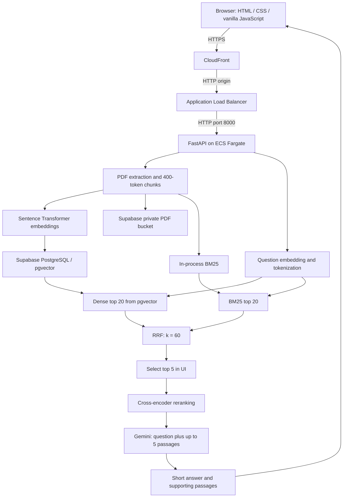

# HR Policy Finder — engineering design and interview guide

**Status:** Implemented demonstration system; not yet a hardened enterprise HR service.  
**Reviewed:** 25 September 2026.  
**Audience:** Project owner, technical interviewer, and future maintainer.  
**Public entry point:** https://d15irokaqyi89p.cloudfront.net/

## 1. Three defensible resume bullets

- Built a hybrid HR-policy retrieval and answer system using semantic search, BM25, reciprocal rank fusion, cross-encoder reranking, and Gemini; the local FAISS evaluation achieved **0.9844 MRR@5 and 0.9796 nDCG@5 across 32 manually labeled synthetic questions**.
- Reduced **mean warm retrieval latency by 72.30%**, from **263.16 ms to 72.90 ms**, by reranking 5 rather than 20 fused candidates; nDCG@5 changed from **0.9771 to 0.9796** on the same CPU benchmark.
- Measured **117.72 ms P95 warm retrieval latency** for top-5 reranking over **96 trials**, and deployed the application through **CloudFront → Application Load Balancer → ECS Fargate**, with persistent documents and vectors in Supabase.

All numeric results above come from `data/benchmark.json`, recorded at 2026-09-25T10:03:06.310847+00:00. They describe **local retrieval**, not deployed response time or Gemini answer accuracy. The 96 trials repeat 32 questions three times; they are not 96 independent questions. The AWS deployment and LLM integration happened separately from this benchmark. Do not claim statistical significance, production accuracy, or a universal best candidate count.

**A 45-second introduction:** “I built a policy finder that lets a user upload an HR PDF and ask a question. It finds passages through semantic and keyword search, combines their rankings, reranks a small candidate set, and sends the best passages with the question to Gemini for a short answer. I measured ranking quality and latency separately. On a small synthetic CPU benchmark, reducing the rerank pool from twenty to five lowered mean retrieval latency from 263 to 73 milliseconds. Production stores vectors in Supabase and runs on ECS behind an ALB and CloudFront. My next priorities are reliable citations, access control, and evaluation on real, held-out questions.”

## 2. Problem statement and scope

HR policies distribute rules, quantities, eligibility conditions, and exceptions across documents. Searching for a word may miss a paraphrase; reading a long passage may hide the exact number the user needs. For example, “vacation allowance” may refer to a section titled “annual leave,” and “notice period” may have different answers during probation and after confirmation.

The system's objective is to retrieve supporting policy evidence and produce a concise answer grounded in that evidence, with expandable passages for inspection. Success requires finding the correct rule **and its conditions**, preserving quantities and units, and measuring the cost of additional ranking stages.

### Requirements and present status

| Requirement | Current implementation | Qualification |
|---|---|---|
| Upload PDF | Text extraction, validation, chunking, embedding, storage | Text-based PDFs only; no OCR |
| Search meaning and exact terminology | Dense plus BM25 | These branches execute sequentially |
| Improve ordering | RRF followed by cross-encoder | Improvement is dataset-dependent |
| Short answer | Gemini prompt requests 1–2 sentences | Prompt instruction is not a correctness guarantee |
| Explain origin | Supporting chunks retain document/page | Answer's citation is currently assigned from result 1, not verified against generation |
| Persistence | Supabase database and private PDF bucket | Local BM25 is rebuilt at startup |
| Measurable performance | Stage timers and offline experiment script | Production load and answer quality are not benchmarked |
| Public demonstration | CloudFront, ALB, ECS | Authentication and tenant separation are absent |

There is no conversation memory, tool-using agent, fine-tuning pipeline, or workflow engine. This is a retrieval-and-generation application with a direct sequence of function calls.

## 3. Current architecture

The diagram shows logical branches, not parallel execution. The backend calls dense search and then BM25. FAISS is the alternative local index and the index used by the recorded evaluator; it is **not installed in the production image**.

### Component ownership

| File | Responsibility | Important symbols |
|---|---|---|
| `app.py` | HTTP validation, startup, shared index, locking, orchestration, metrics | `lifespan`, `SearchRequest`, `upload`, `query`, `metrics` |
| `ingest.py` | PDF validation, text normalization, page-local token windows | `chunk_pdf` |
| `retrieval.py` | Models, local index, lexical scoring, fusion, reranking, generation | `build_index`, `search`, `rrf`, `answer_from_llm` |
| `storage.py` | Server-side configuration and Supabase REST calls | `load_chunks`, `save_document`, `dense_search` |
| `supabase.sql` | Tables, vector index, replacement transaction, search function | `replace_policy_document`, `match_policy_chunks` |
| `evaluate.py` | Relevance metrics, controlled configurations, raw measurements | `quality`, `run` |
| `test_system.py` | Ingestion, retrieval, API, and metric regression checks | unittest test classes |
| `templates/index.html` | Forms, request submission, safe text rendering | Fixed UI retrieval settings |
| `static/style.css` | Responsive visual presentation | No frontend framework |
| `Dockerfile` | Production image with explicit runtime file copies | CPU PyTorch, Uvicorn |

Current Python size: **632 physical lines** across six files, including 161 test lines; 471 lines excluding tests. Physical counts include comments and blanks. There are 10 direct local requirements and 9 production requirements. Transitive dependencies are additional. These counts supersede older counts in the experiment log.

## 4. End-to-end workflow

### A. Application startup

1. Load the pinned embedding model and reranker once per process using cached loader functions.
2. If Supabase is configured, fetch stored chunk text and metadata in batches of 1,000.
3. Rebuild BM25 from these chunks; dense vectors remain in Supabase.
4. Serve requests once startup finishes. Model downloads can make cold starts slow; they are not baked into this image.

### B. Document ingestion

1. The browser sends multipart form data to `POST /upload`.
2. The server enforces a 20 MB read limit, sanitizes the filename to its basename, and checks the `.pdf` extension.
3. `chunk_pdf` checks the PDF signature, rejects encrypted files and more than 300 pages, extracts text with pypdf, normalizes whitespace, and limits extracted text to two million characters.
4. The embedding tokenizer creates approximately 400-token windows with approximately 60-token overlap, inside each page. Boundaries avoid splitting a WordPiece word. Empty/scanned documents without extractable text are rejected.
5. Each chunk gets `chunk_id`, `document`, `page`, and `text`. A chunk ID combines a truncated SHA-256 of filename plus bytes with page and token position. It is an identity key, not encryption or a security boundary.
6. Chunks for the same filename are replaced; other documents remain. The total index is limited to 5,000 chunks on upload.
7. Rebuild the local BM25 replacement index. Encode incoming chunks into normalized vectors. Save the PDF object, then call the database replacement function to replace document/chunk rows in a transaction.
8. Swap the in-memory index only after success, and clear recent latency samples.

**Atomicity boundary:** Database document/chunk replacement is transactional. The PDF object upload happens separately and first. If the database call fails, the PDF object can already have changed. “Everything is atomically replaced” would be incorrect.

### C. Question answering

1. Browser sends `POST /search` with query, mode `rerank`, candidate count 5, and final count 5. Other defaults are dense top-20, BM25 top-20, RRF constant 60. Direct API callers default to **10** candidates; the UI explicitly overrides this to 5.
2. Validate the request and acquire the shared lock. The index must already contain chunks.
3. Encode the question once; call Supabase's `match_policy_chunks` with that vector. Map returned chunk IDs to local positions.
4. Lowercase/tokenize the question and score chunks using BM25. Exclude chunks with no matching token, even if a matching chunk's BM25 score is zero or negative.
5. Fuse rankings using RRF. A chunk in both lists receives two contributions.
6. Keep the best five fused chunks for a UI request. Score each query–chunk pair with the cross-encoder and sort by descending score.
7. Send the query and up to five result texts to Gemini. Ask for one or two short sentences using only those passages, or an explicit “couldn't find” response.
8. Return answer, result metadata, and stage timings. The frontend uses `textContent` to display text safely; full passages and timing are collapsed.

The LLM does not search Supabase itself. The cross-encoder does not write the answer. The embedding model does not decide the number of leave days. Each component has a different job.

### D. One concrete example

For “How many annual leave days do I get?”, the synthetic policy says “20 working days.” Semantic search can match the meaning; BM25 recognizes “annual” and “leave”; RRF combines their preferences; the reranker evaluates the question with each shortlisted passage; Gemini turns the selected evidence into a short sentence. **20 comes from the document, not application code.** A correct response must retain “working days,” and a different employee category may require a different rule.

## 5. Concepts explained three levels deep

### RAG: retrieval-augmented generation

**Intuition:** Give a writer the relevant pages before asking them to answer.

**Implementation:** `search` supplies passages; `answer_from_llm` places them beside the question in a prompt. This changes the information available during inference, not the model's weights.

**Deeper:** Retrieval error and generation error are separate. The right passage can be retrieved but misread; a fluent answer can be produced from irrelevant evidence. Therefore measure evidence recall, answer correctness, faithfulness to sources, and abstention separately. Fine-tuning would change model parameters; this project does not train or fine-tune models.

### Tokens, chunking, and overlap

**Intuition:** Divide a long book into manageable pieces; repeat a little at each boundary so a rule is not separated from its explanation.

**Implementation:** Tokens are model vocabulary units, not necessarily words. The tokenizer supplies character offsets so chunks preserve source wording. Defaults are 400 tokens with about 60 repeated tokens; page boundaries terminate windows.

**Deeper:** Short chunks improve focus but can detach exceptions; large chunks include context but may dilute embeddings and exceed model limits. For a long page, a nominal stride is 340 tokens; overlap adds roughly `400/340 - 1 = 17.6%` token processing, before boundary effects. The cross-encoder accepts 512 tokens for the **combined question and passage**, including special tokens. A 500-character query is not a 500-token query. The default is sensible but not experimentally proven optimal: most benchmark pages form a single short chunk. Page-local chunking also loses cross-page continuity.

### Embeddings and the bi-encoder

**Intuition:** Represent text as a point so related meanings are nearby.

**Implementation:** `multi-qa-MiniLM-L6-cos-v1` encodes each passage and question separately into the shared 384-dimensional vector space used by the database schema. Passage vectors are computed at ingestion and reused at query time. The embedding model is loaded through Sentence Transformers, which uses PyTorch for inference here.

**Deeper:** A vector coordinate is a learned feature, not a human-readable slot such as “leave days.” Semantic proximity does not prove logical implication: “eligible” and “not eligible” can still be close. A bi-encoder can precompute documents because their representation does not depend on the current question. Switching models requires re-embedding the corpus; matching dimensions alone does not make different model spaces compatible.

### Cosine similarity, FAISS, pgvector, and HNSW

**Intuition:** Compare the direction of two text vectors to estimate semantic relatedness.

**Implementation:** Cosine similarity is `(q · d) / (||q|| ||d||)`. Normalization makes each norm 1, so inner product equals cosine similarity. Local FAISS uses `IndexFlatIP`, an exact scan. Supabase's SQL orders by cosine distance `<=>` and returns `1 - distance` as similarity.

**Deeper:** FAISS is a similarity-search library, not the durable database in this deployment. pgvector adds vectors and distance operators to PostgreSQL. The schema declares an HNSW approximate index: a layered graph that trades extra memory/build work and possible missed neighbors for faster search. Declaring HNSW does not prove PostgreSQL used it on a particular query; inspect `EXPLAIN ANALYZE`. On small tables the planner may choose an exact scan. ANN retrieval quality should be compared against an exact baseline. See [pgvector documentation](https://github.com/pgvector/pgvector).

### BM25 lexical retrieval

**Intuition:** Match the actual words, giving distinctive words more importance.

**Implementation:** Lowercase Unicode word tokens feed `BM25Okapi`. It scores term matches, with term-frequency saturation and document-length normalization. “POSH” or a policy acronym can be especially useful when semantic interpretation is uncertain.

**Deeper:** A common BM25 form is `Σ IDF(t) × f(t,d)(k1+1) / [f(t,d)+k1(1-b+b|d|/avgdl)]`. Term frequency stops gaining linearly; `b` controls length normalization. Exact IDF handling varies by implementation. This code keeps matching terms even with nonpositive scores, important in tiny corpora. Token matching is not phrase matching: “notice period” becomes two words. There is no stemming, synonym dictionary, explicit phrase bonus, or exact-number reasoning. The implementation scores the corpus and sorts results; it is not an Elasticsearch-scale inverted search service.

### Hybrid retrieval and RRF

**Intuition:** Ask both a meaning-based finder and a word-based finder, then combine their ordered suggestions.

**Implementation:** Each returns up to 20 chunks. `RRF(d) = Σ 1/(60 + rank(d))`, using ranks starting at 1. Missing results receive no contribution. Raw BM25 and cosine scores are never added together.

**Deeper:** Suppose A is dense rank 1 only: `1/61 ≈ 0.01639`. B is dense rank 2 and BM25 rank 1: `1/62 + 1/61 ≈ 0.03252`; B wins. The constant 60 dampens the difference between adjacent ranks. It is not the candidate count or result count. RRF avoids score calibration but discards score magnitude, so a weak lexical match can hurt ordering. Indeed, RRF alone underperformed dense-only on this fixture. The union contains at most 40 unique chunks, often fewer.

### Cross-encoder reranking and candidate cutoff

**Intuition:** After finding possible pages quickly, read each shortlisted page together with the question more carefully.

**Implementation:** `ms-marco-MiniLM-L6-v2` receives query–passage pairs and emits relevance logits. It reranks only the fused cutoff, not the full corpus. Results are sorted by these logits.

**Deeper:** Joint encoding permits token interactions across query and passage. That makes each score query-dependent, so document scores cannot be precomputed once like embeddings. A logit is not a probability or a percentage confidence. A missed relevant chunk outside the cutoff is unrecoverable. With five candidates and five final results, reranking changes their **order**, not membership; top-5 recall cannot improve merely by reordering those same five chunks. The library's [retrieve-and-rerank guide](https://www.sbert.net/examples/sentence_transformer/applications/retrieve_rerank/README.html) explains this two-stage design.

### Gemini and grounding

**Intuition:** Use the best evidence to write the short answer the user actually wants.

**Implementation:** A direct HTTP call to the `gemini-flash-lite-latest` alias sends the question and five passage texts. Generation uses temperature 0, up to 100 output tokens, and a 30-second client timeout.

**Deeper:** Temperature 0 reduces sampling variability; it does not guarantee correctness, determinism, or faithful citations. A token cap can truncate an answer. The `latest` alias can change behavior over time. The current prompt does not send document/page metadata and does not ask for structured citation IDs. The backend simply attaches the first result's document/page, so a generated answer using another passage can have a misleading citation. Free API access is subject to provider quota and terms; the code does not prove account billing eligibility. AWS and database resources are separate costs. Verify current [Gemini pricing and terms](https://ai.google.dev/gemini-api/docs/pricing) before sending confidential policy data.

### Recall@5, MRR@5, and nDCG@5

**Intuition:** Recall asks “did we find the evidence?”, MRR asks “how soon was the first useful result?”, and nDCG asks “did the most useful evidence appear near the top?”

**Implementation:** Labels use `(document, page)` with grade 2 for direct evidence and 1 for supporting evidence. Only the first occurrence of each page gets credit among the five returned chunks.

**Deeper:** Recall is relevant pages found divided by labeled relevant pages. If 2 of 3 appear, recall is 2/3. Reciprocal rank is 1/rank of the first relevant page: rank 2 gives 0.5; absent from the first five gives zero. MRR averages that value over queries. `DCG@5 = Σ (2^grade - 1)/log2(rank + 1)`; nDCG divides it by ideal DCG. For grades `[1,2]`, DCG is `1 + 3/log2(3) ≈ 2.893`; ideal `[2,1]` is about 3.631; nDCG is about 0.797. These metrics measure retrieved evidence, not generated answers. A relevant page may receive credit even when the returned chunk lacks the exact answer span.

### Latency, percentiles, and throughput

**Intuition:** Average describes a typical aggregate; P95 describes the slow tail; throughput counts completed requests over time.

**Implementation:** `perf_counter()` times embedding, dense search, BM25, fusion, and reranking. The API separately times generation and sums retrieval plus generation into `total_response_ms`. `/metrics` summarizes the last 100 successful retrieval timings.

**Deeper:** These internal timers exclude waiting for the application lock, browser/network time, and some API setup/serialization. Production dense timing includes the Supabase call; local benchmark dense timing does not. P95 is a sample percentile, not a worst-case bound. A global lock is held during generation, so slow provider responses queue other requests. Low isolated latency does not establish high concurrent throughput. CloudFront and ALB timeout behavior also needs slow-upload and slow-generation tests.

### Docker, ECS, ALB, and CloudFront

**Intuition:** Docker packages the app; ECS runs it; ALB finds a healthy running copy; CloudFront supplies the stable public HTTPS entry point.

**Implementation:** The Dockerfile copies runtime Python, HTML/CSS, and the saved benchmark. ECS Fargate runs the container without a user-managed EC2 host. The ALB uses an IP target group on port 8000 and checks `/`. CloudFront points at ALB DNS, so changing task IPs do not change the user URL.

**Deeper:** An ECR image is the packaged artifact; an ECS task is a running instance; a service maintains the desired task count. CloudFront is a CDN/reverse proxy, not a vector database or application runtime. Current TTLs are zero, so do not claim measured caching acceleration. Browser→CloudFront is HTTPS; the configured origin is HTTP. Two ALB subnets do not create application redundancy: the verified service has one desired task. A health check returning the homepage does not exercise Supabase or Gemini.

## 6. Technology decisions and alternatives

| Choice | Why it fits this project | Why not the alternative now | When to reconsider |
|---|---|---|---|
| FastAPI + Pydantic | Small typed API with request constraints | Django adds unused application machinery; Flask would need more manual validation | Broader application requirements |
| Plain HTML/CSS/JS | Upload, question, answer, disclosure controls need little state | React/Next add a build/runtime ecosystem for few interactions | Complex client state or many screens |
| pypdf | Required text-based PDF extraction | OCR adds compute, dependency and error handling | Real users need scanned files |
| Token windows | Easy to reason about and vary experimentally | Semantic chunking adds another model/heuristic without measured need | Section/table splitting demonstrably hurts recall |
| Compact local embedding/rerank models | CPU inference, reusable embeddings, controllable candidate cost | Larger models/GPU/API embeddings need justified quality or throughput gains | Held-out comparison demonstrates value |
| PyTorch | Runtime used by the selected neural models | Removing it requires changing inference backend, not just deleting a package | Benchmark an ONNX/other supported runtime |
| Supabase Postgres + pgvector | Durable text, vectors, metadata, SQL transaction; PDF object storage | Separate managed vector service would add another system | Scale/filtering/SLA needs justify migration |
| FAISS for local experiments | Simple exact vector baseline without network variance | FAISS alone does not supply this deployment's durable tables/object storage | Useful offline or with an explicit persistence layer |
| rank-bm25 | Transparent baseline with no lexical server | Elasticsearch/OpenSearch adds operations overhead at 5,000 chunks | Larger corpus or advanced lexical filtering |
| RRF | Combines ranks without calibrating score scales | Weighted raw sums need normalization and tuning data | Sufficient held-out data for tuned fusion |
| Limited cross-encoder pool | Measured latency-quality tradeoff | Reranking every chunk spends inference on weak candidates | Larger pools recover missed evidence in tests |
| Direct Gemini HTTP request | Minimal generation integration | LangChain/LlamaIndex unnecessary for a straight-line pipeline | Shared orchestration complexity actually emerges |
| Single process + lock | Simple in-process consistency | Redis/Celery/workers add coordination before load is known | Concurrency and ingestion timing justify redesign |
| Docker + ECS Fargate | Repeatable runtime and managed container scheduling | Direct EC2 deployment requires host lifecycle management | Cost/operational comparison favors another host |
| ALB + CloudFront | Stable origin, task health routing, public HTTPS URL | Direct ECS IP changes on replacement | Custom domain and end-to-end TLS are next refinements |

These are contextual choices, not claims that the alternatives are bad or that any selected model is the best on the market.

## 7. Measured evaluation and honest interpretation

| Configuration | Recall@5 | MRR@5 | nDCG@5 | Mean ms | P50 ms | P95 ms |
|---|---:|---:|---:|---:|---:|---:|
| Dense only | 1.0000 | 0.9792 | 0.9717 | 10.99 | 9.70 | 18.41 |
| BM25 only | 0.9219 | 0.8542 | 0.8510 | 0.28 | 0.24 | 0.39 |
| Dense + BM25 + RRF | 1.0000 | 0.9635 | 0.9555 | 14.69 | 10.20 | 19.81 |
| Hybrid + rerank 5 | 1.0000 | 0.9844 | 0.9796 | 72.90 | 66.16 | 117.72 |
| Hybrid + rerank 10 | 1.0000 | 0.9844 | 0.9771 | 153.49 | 119.03 | 273.83 |
| Hybrid + rerank 20 | 1.0000 | 0.9844 | 0.9771 | 263.16 | 224.94 | 506.96 |

**Method:** One fictional 24-page PDF, 24 chunks, 32 manually authored queries, three repetitions, six configurations, 576 timed searches. CPU inference on macOS ARM64 with four Torch threads. One warm-up per configuration; randomized trial order with seed 42. Models and package versions plus corpus/dataset hashes are recorded. No embedding or rerank score reuse between trials.

**Calculation:** `(263.1588 - 72.8953) / 263.1588 × 100 = 72.30%` reduction in mean retrieval time. Reranking-stage mean fell from 250.7784 to 61.9508 ms, a separate **75.30%** reduction. `0.9796049 / 0.9770962 × 100 = 100.26%` nDCG retention; above 100 means a slight measured increase, not more than perfect accuracy.

**Interpretation:** Five candidates were best among the tested cutoffs on this fixture. RRF alone did not beat dense-only. More reranking candidates did not automatically improve quality. Small differences should not be overstated. There is no held-out test set, answer-generation benchmark, load test, or measured CloudFront speedup in this artifact.

**Reproduction:** Use local requirements, cached model revisions, and `HF_HUB_OFFLINE=1 .venv/bin/python evaluate.py --repeats 3 --output /tmp/hr-benchmark-review.json`. Use a different output path to preserve the historical benchmark. Run again without offline mode only if models must be downloaded. The evaluator calls retrieval directly and does not invoke Gemini or production Supabase search.

**Current tests:** Exact-number regression tests assert the expected number/phrase exists in a returned passage; they do not establish correctness of the generated answer. The API test assumes an initially empty index and now depends on LLM configuration, so it is not an isolated production acceptance test. This documentation review does not claim to have rerun those historical tests.

## 8. API and data contracts

| Endpoint | Input | Output / notable behavior |
|---|---|---|
| `POST /upload` | Multipart PDF; optional chunk size and overlap | Document and chunk counts; same filename replaces |
| `POST /search` | Query up to 500 characters; mode and ranking limits | Answer, ranked chunks, score type, candidate count, stage timings |
| `GET /metrics` | None | Current counts, recent retrieval timing, historical benchmark summary |
| `GET /` and `/static/style.css` | None | Frontend assets |

Input limits: 20 MB PDF, 300 pages, two million extracted characters, 5,000 chunks; window 32–500 tokens with overlap below window size; retrieval limits 1–100. Search-before-upload gives 409; invalid parameters generally 422; malformed PDF 400; oversized file 413; handled service failures 503. HTTP transport exceptions are not consistently translated into the same friendly service error.

`policy_documents` holds UUID, unique filename, object path, and creation time. `policy_chunks` holds chunk ID, document foreign key with cascade delete, document name, page, text, and `vector(384)`. The private `policy-pdfs` bucket holds original bytes. RPCs provide document replacement and cosine search. Anonymous/authenticated database access is revoked in the supplied SQL and the server uses the service-role key. **This does not authenticate users of the public FastAPI application.**

## 9. Limitations, consequences, and improvements

| Priority | Observed limitation | Consequence | Concrete next step and verification |
|---|---|---|---|
| Before confidential use | Public API has no login, tenant scope, or document authorization | Users can query the shared corpus and replace a matching filename | Add identity and server-side document authorization; test cross-user denial |
| Before confidential use | Top passages are sent to an external LLM | HR content leaves the storage/app boundary | Approve data handling/provider terms; use a suitable account/model policy |
| Before stronger security claims | CloudFront origin is HTTP; prior setup left direct task/ALB ingress public | HTTPS at the public URL does not prove end-to-end TLS or origin isolation | Configure origin TLS and scoped ingress; verify external paths explicitly |
| Answer correctness | Citation is copied from result 1 | Answer may rely on a different passage | Give Gemini passage IDs, return structured source IDs, validate evidence |
| Answer correctness | No robust answerability or prompt-injection defense | Irrelevant or malicious document instructions can influence answers | Treat context as untrusted evidence; evaluate no-answer/adversarial cases |
| Answer correctness | No policy version/effective date/employee scope | Conflicting policies can produce the wrong number | Add relevant metadata and filters; ask clarification on conflicting scope |
| Answer correctness | Tables/columns and cross-page rules can extract poorly | Quantities can lose their labels or exceptions | Inspect extraction fixtures; add layout-aware parsing only where needed |
| Reliability | PDF object and database writes are separate | Failure can leave mismatched original and chunks | Immutable/versioned object paths plus cleanup or coordinated replacement |
| Reliability | Local BM25 snapshots refresh only at startup/upload | Multiple tasks can disagree with current database rows | Version corpus snapshots and refresh atomically before scaling |
| Performance | Shared lock includes remote calls and generation | One slow request blocks others, including metrics | Measure queue time; use immutable index snapshots and bounded concurrency |
| Performance | BM25 full scoring/sorting and full rebuilds | Corpus growth increases CPU/memory and ingestion time | Measure at larger sizes; consider a lexical index when justified |
| Reliability | Remote HTTP errors/timeouts, no retries/backoff | Temporary provider failure can fail a request | Bounded retries where safe, clear timeout/quota errors, provider monitoring |
| Reproducibility | Gemini `latest` alias and startup downloads | Answer behavior and cold-start availability can vary | Record/pin suitable model version; cache model artifacts with release |
| Availability | Single desired ECS task | Multi-AZ ALB does not remove single-task capacity failure | Fix shared-state consistency, then test multiple replicas and failover |
| Evaluation | Tiny synthetic development set; page labels | High numbers may not generalize; answer errors are unmeasured | Held-out realistic questions, answer-span labels, negative cases, reviewer agreement |
| Operations | Deployment was created through CLI, not checked-in IaC | Rebuilding and auditing environment is harder | Add minimal infrastructure-as-code and rollback runbook when maintaining long-term |

Recommended sequence: first protect data and correct citations; then evaluate generation on real questions; then address consistency/concurrency; only then optimize scale. No improvement in this table has been implemented or measured by this documentation work.

## 10. Interview question bank with answer guidance

### Fundamentals and project ownership

**1. What problem did you solve?** Policy information is hard to locate and easy to misread. I retrieve relevant evidence and produce a concise answer with source passages. Follow-up: explain why exact units and eligibility conditions matter more than fluent prose.

**2. Is this a chatbot, a search engine, or RAG?** It started as retrieval/ranking and now adds LLM generation after retrieval. It has no conversation memory. Follow-up: show the boundary between `search` and `answer_from_llm`.

**3. Did you train these models?** No. I integrated pretrained embedding and reranking models and a hosted generation model. My work is ingestion, retrieval composition, evaluation, API, UI, persistence, and deployment. Do not imply proprietary model training.

**4. What would you remove for the simplest baseline?** Start with dense-only retrieval and measure. The saved dense baseline is strong; hybrid stages need empirical justification. For exact-term-heavy data BM25 is another inexpensive baseline.

### Retrieval and ranking

**5. Why embeddings instead of keyword search alone?** They can retrieve paraphrases. Follow-up: embeddings can confuse similar but contradictory rules, so semantic proximity is not proof of the answer.

**6. Why keep BM25?** Exact acronyms and terminology provide complementary evidence. Follow-up: it did not outperform dense on this dataset and RRF alone reduced nDCG; say this openly.

**7. Why not add BM25 scores to cosine scores?** Their scales and meanings differ. RRF combines ranks. Follow-up: RRF sacrifices the magnitude of confidence differences.

**8. Explain the three different K values.** Dense/BM25 top-K controls candidate retrieval; RRF's 60 is rank damping; final top-K controls returned results. The rerank cutoff independently controls expensive pair scoring.

**9. Why five candidates?** It was the best tested 5/10/20 latency-quality tradeoff on the development fixture. Follow-up: it is not a universal best value and needs retuning on harder data.

**10. Can reranking recover missing evidence?** Only if that evidence exists inside the fused cutoff. Follow-up: measure candidate recall before blaming the reranker or LLM.

**11. Can top-5 reranking improve Recall@5 if it receives exactly five candidates?** No: membership stays the same. It can improve MRR/nDCG by moving better evidence earlier.

**12. Is a reranker score of 8 an 80% confidence?** No. It is a raw relevance logit. Calibration against labeled outcomes would be needed for probability-like interpretation.

**13. Why normalized vectors?** Inner product then matches cosine similarity. Follow-up: explain why corpus/query vectors must use the same model and preprocessing.

**14. FAISS or Supabase—which is actually used?** Production uses Supabase pgvector. The local benchmark uses exact FAISS `IndexFlatIP`. Follow-up: acknowledge differing network and approximation characteristics.

**15. What does HNSW do?** It navigates a hierarchical proximity graph for approximate neighbors. Follow-up: index definition alone does not prove index use; compare query plans and ANN recall with exact search.

### Chunking, ingestion, and data

**16. Why 400 tokens and 60 overlap?** Context retention with headroom for a paired reranker input. Follow-up: not a measured optimum, and long questions can still truncate.

**17. Why not split by 400 words?** Models enforce token budgets; a word can occupy multiple tokens. Follow-up: tokenizer offsets preserve original source substrings.

**18. What happens if a policy continues on the next page?** Current chunks do not cross pages. The rule and exception may separate; this is a known limitation, not a solved semantic-chunking feature.

**19. What if the same PDF is uploaded twice?** Same filename replaces that document. Different filenames can duplicate content. Follow-up: the current key is not content-only deduplication and there is no version history.

**20. What happens if saving fails halfway?** The in-memory replacement is not published until success, but the PDF object may already be updated. Database rows replace transactionally. Explain the two storage boundaries.

**21. Why keep original PDFs and chunks?** Original bytes support inspection/reprocessing; chunks support search; vectors support similarity. They are three representations of related information, not redundant database products.

### Generation and trust

**22. Why send the query again to the LLM?** Passages supply evidence, but the query defines what to answer. Retrieval relevance does not specify the final response by itself.

**23. Does temperature zero prevent hallucinations?** No. It is a generation setting, not evidence verification. Follow-up: use answerability tests and source-grounded evaluation.

**24. How do you know the citation supports the answer?** Currently I cannot guarantee it: code attaches the first result. The next improvement is validated passage IDs, not merely adding a citation-looking string.

**25. What if two policies disagree on leave days?** Current retrieval lacks effective-date/employee-category rules. A reliable system should filter by scope or surface ambiguity and request clarification.

**26. Can a PDF tell the LLM to ignore instructions?** Yes, retrieved text is untrusted input. Frontend escaping prevents HTML execution but does not solve model prompt injection.

### Metrics and experimental reasoning

**27. What does 0.9844 MRR mean?** The mean reciprocal rank of the first relevant page in the top five is 0.9844. It is not 98.44% answer accuracy.

**28. Why nDCG as well as recall?** Recall ignores ordering and relevance strength. nDCG rewards high-grade evidence near the top. Follow-up: explain duplicate-page handling.

**29. Did hybrid beat dense?** RRF alone did not. Top-5 reranking had slightly higher nDCG than dense, but at greater latency. Small-set differences are not evidence of universal superiority.

**30. Where did 72.30% come from?** The mean retrieval times for rerank-20 and rerank-5, using `(baseline-optimized)/baseline × 100`. Follow-up: distinguish the 75.30% reranking-stage reduction.

**31. Why repeat queries?** To sample timing variation. Repetition does not create new labeled questions or validate generalization.

**32. What is missing from your evaluation?** Production Supabase latency, generation correctness, no-answer behavior, conflicting policies, long documents, multilingual/scanned files, cold starts, queueing, concurrency, and failure recovery.

**33. How would you validate exact numbers?** Label expected value, unit, eligibility, conditions, and evidence span. Test annual versus casual leave, probation versus confirmed notice, and days versus working days. Judge generated answers, not just retrieved phrase presence.

### Deployment, reliability, and scale

**34. Why ALB between CloudFront and ECS?** ECS task addresses can change; ALB DNS is stable and target registration tracks tasks. Follow-up: ALB health checks are not a full dependency health test.

**35. Is the whole request encrypted?** Viewer HTTPS is configured, but CloudFront→ALB is HTTP in this setup. Do not claim end-to-end TLS.

**36. Is the service highly available?** One desired task was verified. The ALB spans subnets, but application capacity is still single-task. Redundancy needs consistent shared state and multiple healthy tasks.

**37. Why not simply scale to ten containers?** Each has a separate BM25 snapshot and lock. Uploads can leave other replicas stale. Solve corpus versioning/refresh before claiming correct horizontal scaling.

**38. What is your bottleneck?** In the local experiment, reranking dominates retrieval. In production, generation, Supabase round trips, and queueing may dominate. Measure instead of transferring local conclusions directly.

**39. Is the project free because Gemini is free?** No. Free API availability has limits; ECS, ALB, networking, storage, and other services can cost money. Exact cost needs billing evidence and usage assumptions.

**40. How would you debug a wrong answer?** Inspect extraction, then candidate recall, fused cutoff, reranked evidence, and finally the generated answer/citation. Identify the earliest failed stage before changing the prompt or model.

## 11. Practical interview exercises

1. Compute RRF for dense `[A,B,C]` and BM25 `[C,A,D]` with k=60. Explain why A and C outrank single-list hits.
2. Given relevant pages `{1,3}` and returned pages `[2,3,3,1,4]`, calculate Recall@5 and MRR@5. Answers: 1.0 and 0.5; the second page-3 hit earns no additional gain.
3. Explain how the answer could be wrong despite Recall@5=1: missing conditions in the selected chunk, wrong scope, generation error, or citation mismatch.
4. Sketch failure after object upload but before database commit. Identify which representation changed and how versioned object keys would help.
5. Explain why a 117.72 ms retrieval P95 does not predict browser response P95: model generation, transport, queueing, and deployment environment differ.

## 12. Maintenance and evidence notes

This guide follows current source rather than historical descriptions. `README.md` still contains claims that answers are extractive, that no deployment exists, and that httpx is only a test dependency; those are stale. `docs/decisions.md` and the saved graph also mention removed `answer_excerpt` logic. `docs/experiments.md` remains useful as a dated measurement record, but its earlier test/LOC/answer-selection descriptions do not describe all current behavior.

Evidence hierarchy: current Python/SQL/frontend source for implementation; raw benchmark JSON for numbers; live AWS read for service state; prior deployment configuration for CloudFront/ALB details. During this review ECS reported one desired/running task and a completed deployment. No source-code fixes, infrastructure mutations, benchmark reruns, or production correctness guarantees are implied by this document.

For study: first learn the workflow and 45-second explanation; next reproduce the RRF and metric arithmetic; then prepare the limitation answers. Being precise about what you measured and what remains unfinished is stronger than describing the app as enterprise-ready.
